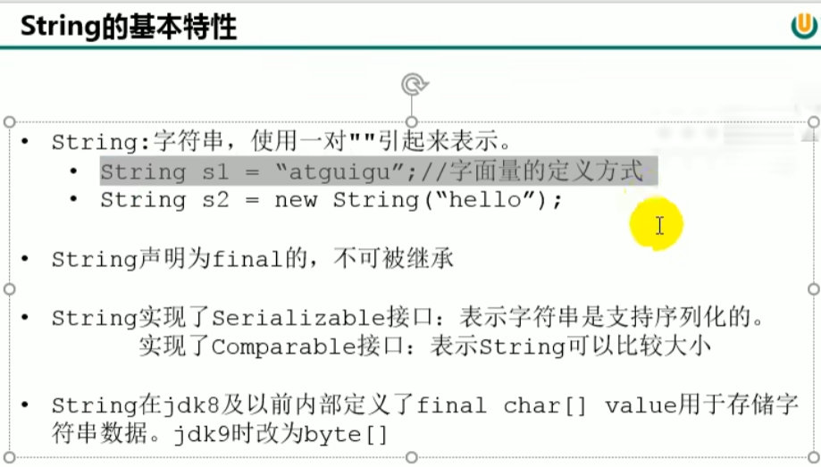
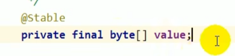
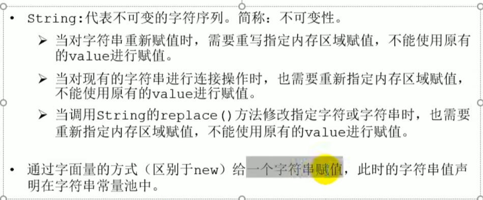
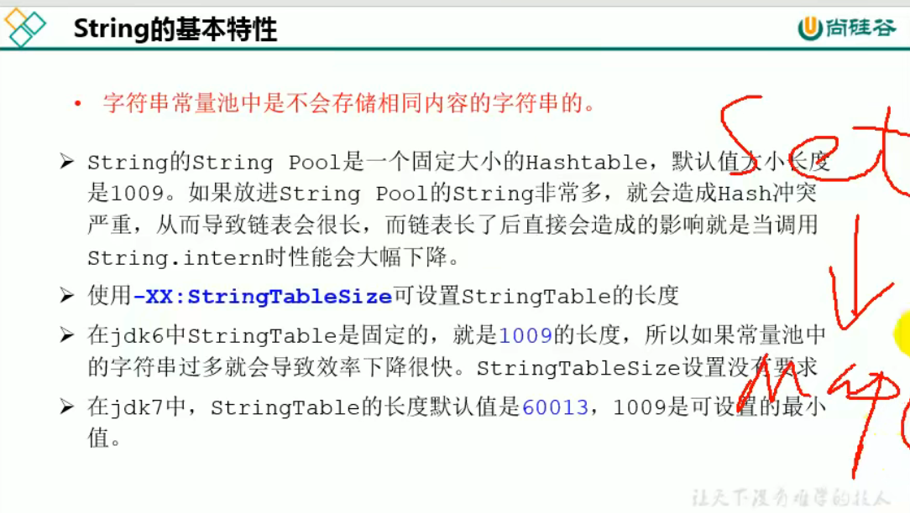
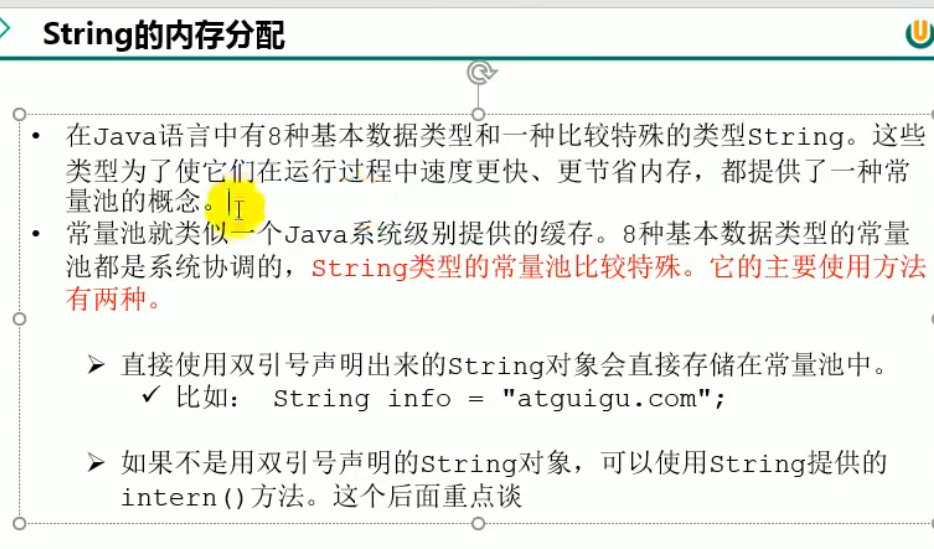

string 是final不可被继承的

jdk 1.8 中还是char[]数组，从1.9起就变成了byte[]字节数组

最主要的目的是为了节省字符串占用的内存，char占两字节，16位，一个中文还是两个byte，再加上编码标识。

相关的stringBuffer stringBuilder也做了修改。

对象实例存放在字符串常量池，value重新赋值或者修改都是重新开辟内存空间。

JDK1.8中字符串常量池和运行时常量池逻辑上属于方法区，但是实际存放在堆内存中。以前是在永久代（永久代小，回收频率低）。

string的string pool是一个固定大小的hashTable，一个数组加链表，jdk7长度是60013，jdk8开始1009是可设置的最小值。

string pool不像hashmap达到0.75的临界值会扩容。

String的内存分配
---
直接引用双引号的直接存储在常量池（堆）。

拼接操作
---

    String s1 = "a" + "b" + "c";
    在编译成class文件后，变为
    String s1 = "abc";