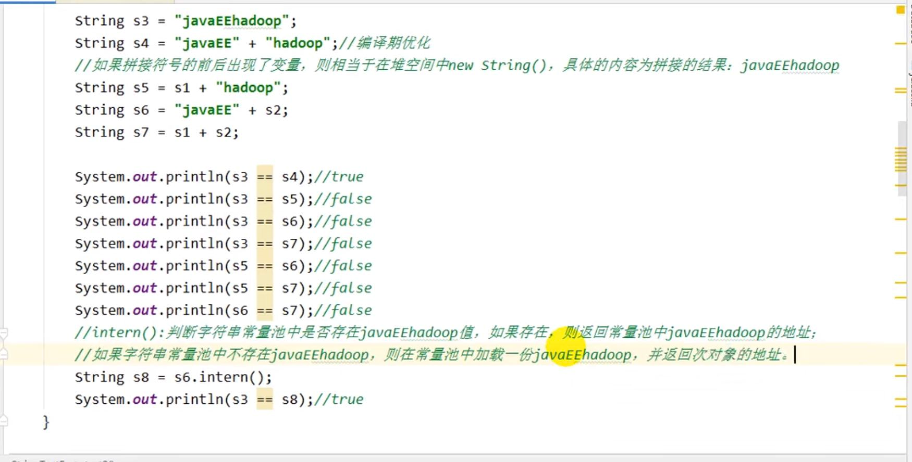
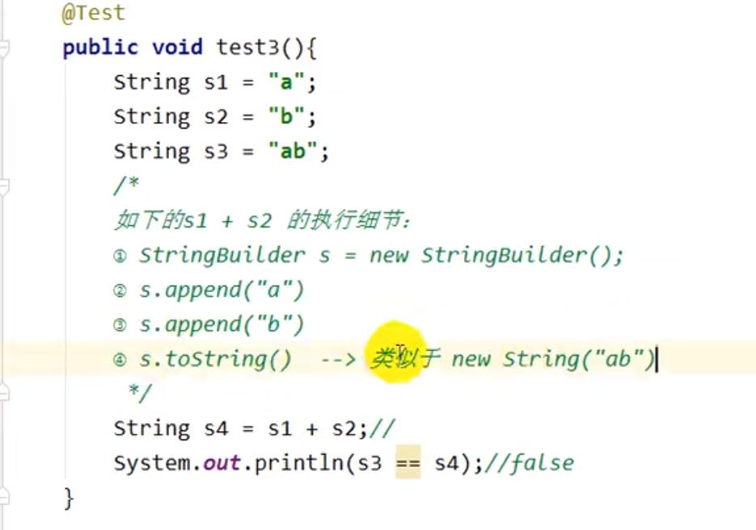
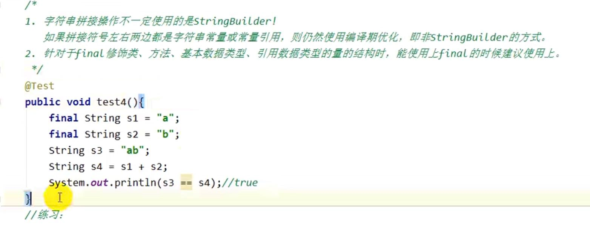
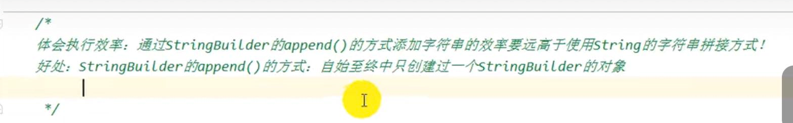
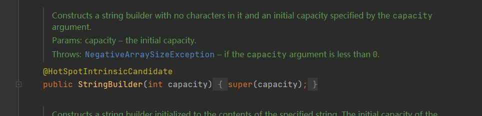
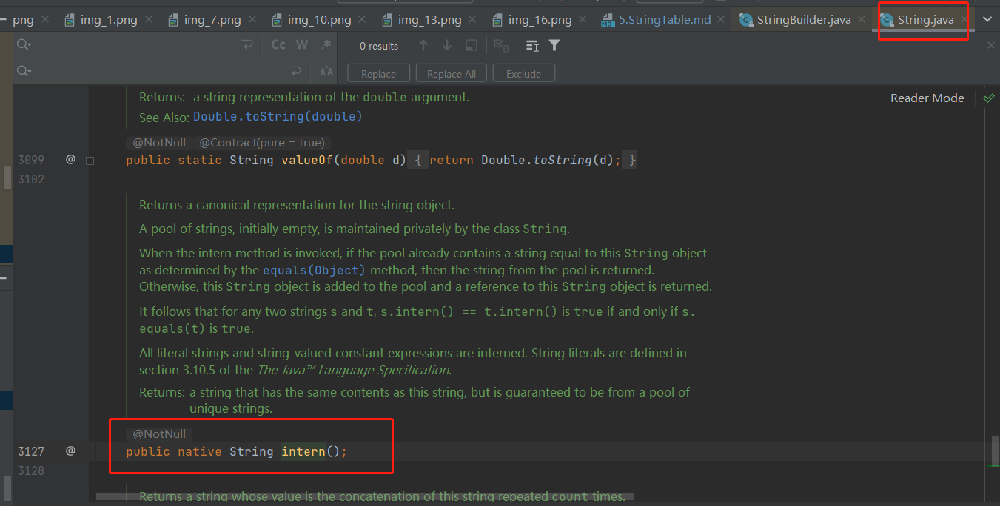
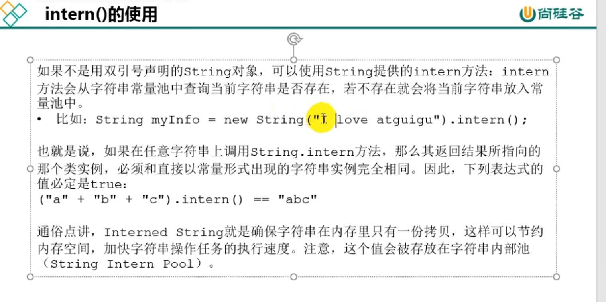
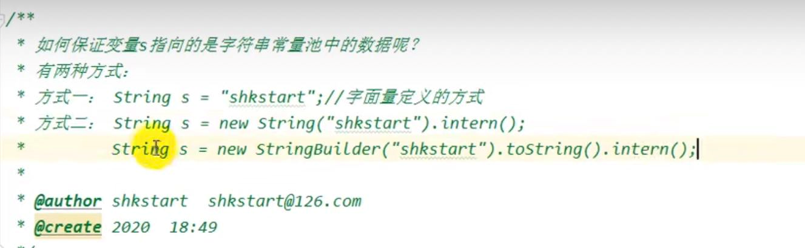
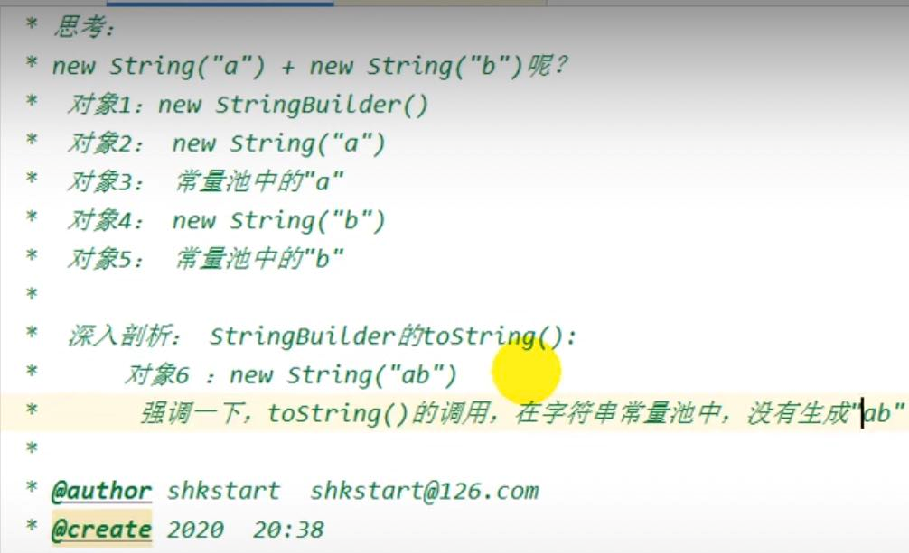
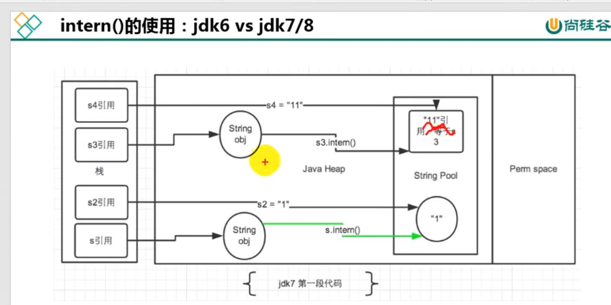

string 是final不可被继承的

jdk 1.8 中还是char[]数组，从1.9起就变成了byte[]字节数组

最主要的目的是为了节省字符串占用的内存，char占两字节，16位，一个中文还是两个byte，再加上编码标识。

相关的stringBuffer stringBuilder也做了修改。

对象实例存放在字符串常量池，value重新赋值或者修改都是重新开辟内存空间。

JDK1.8中字符串常量池和运行时常量池逻辑上属于方法区，但是实际存放在堆内存中。以前是在永久代（永久代小，回收频率低）。

string的string pool是一个固定大小的hashTable，一个数组加链表，jdk7长度是60013，jdk8开始1009是可设置的最小值。

string pool不像hashmap达到0.75的临界值会扩容。

String的内存分配
---
直接引用双引号的直接存储在常量池（堆）。

字符串拼接操作
---

    String s1 = "a" + "b" + "c";
    在编译成class文件后，变为
    String s1 = "abc";

    String s1 = "abc";
    String s2 = s1 + "de";
    如果说拼接符号出现了变量，则相当于在堆空间中new String();

判断字符串常量池中是否有该值，存在的话直接返回地址，不存在则存入常量池，并返回地址。

String s1 = "javaEE";

String s2 = "hadoop";

字符串变量拼接内使用了StringBuilder(如果修饰符都是final就不是用StringBuilder)

new String()是在堆空间创建对象实例， s1= "a"是直接在常量池中存放变量实例。

注：加final的变量在类加载准备期间就显式初始化了。

StringBuilder 可指定数组容量，避免数组扩容copy数据。

    StringBuilder stringBuilder = new StringBuilder(int capacity); 

String.intern();
---

native本地方法

如何保证变量指向字符串常量池中的数据？
---

直接用双引号声明或者结尾加.intern()

new String() 两个对象 一个在堆 一个在字符串常量池

new String("a") + new String("b")呢？

        String s = new String("1");
        s.intern();
        String s2 = "1";
        System.out.println(s == s2); //false

        String s3 = new String("1") + new String("2");
        s3.intern();
        String s4 = "12";
        System.out.println(s3 == s4); //truef

