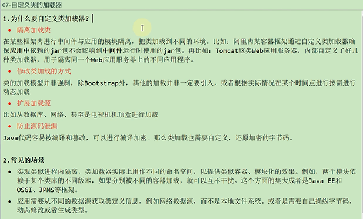
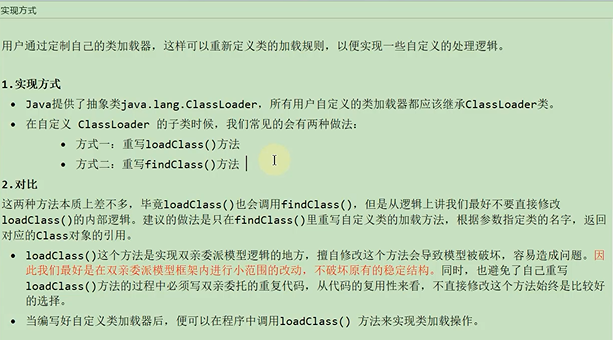
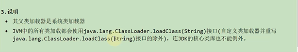

为什么要自定义类加载器？
---

    隔离加载类

    修改类的加载方式

    扩展加载源

    防止源码泄漏

如何实现自定义类加载器
---

    1 重写loadClass()

    2 重写findClass()

    loadClass()实现了双亲委派机制的逻辑 擅自修改会导致模型被破坏 容易出问题

    @Override
    protected Class<?> findClass(String name) throws ClassNotFoundException {
        BufferedInputStream bufferedInputStream = null;
        ByteArrayOutputStream byteArrayOutputStream = null;
        try {
            //获取字节码文件完整路径
            String fileName = byteCodePath + name + ".class";
            //获取输入流
            bufferedInputStream = new BufferedInputStream(new FileInputStream(fileName));
            //获取输出流
            byteArrayOutputStream = new ByteArrayOutputStream();
            //读入数据并写出的过程
            int len;
            byte[] data= new byte[1024];
            while ((len = bufferedInputStream.read(data)) != -1) {
                byteArrayOutputStream.write(data, 0, len);
            }

            //获取内存中完整的字节数组的数据
            byte[] bytes = byteArrayOutputStream.toByteArray();
            //调用defineClass() 将字节数组的数据装欢为class的实例
            Class<?> aClass = defineClass(null, bytes, 0, bytes.length);
            return aClass;
        } catch (Exception e) {
            e.printStackTrace();
        } finally {
            try {
                if (bufferedInputStream != null) {
                    bufferedInputStream.close();
                }
                if (byteArrayOutputStream != null) {
                    byteArrayOutputStream.close();
                }
            } catch (IOException e) {
                e.printStackTrace();
            }

        }
        return super.findClass(name);
    }