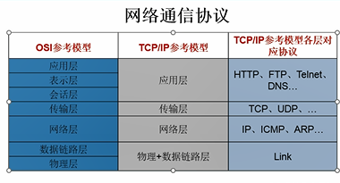
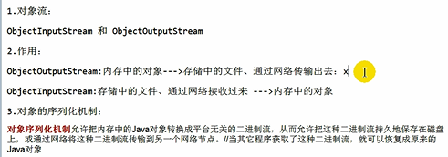

TCP和UDP（传输层）
---

TCP需要三次握手 进行大数据量传输；安全性高，但是效率低

UPD以数据报形式返送，数据限定为64k,效率高

 
URL（统一资源定位符）
---

http://192.168.1.17:8080/test/hello 

HTTP://IP:PORT/资源

对象序列化过程
---

实现Serializable接口

对象流

    ObjectOutPutStream

    ObjectInputStream

