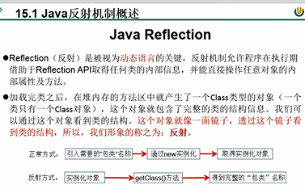

Reflection
---

允许在程序在运行期间通过reflection API获取类的信息，操作类的内部属性和方法

正常创建对象流程

    引入需要的包类名称

    通过new关键字实例化

    取得对象实例

反射创建对象流程

    实例化对象 newInstance()

    getClass()方法

    得到完整的包类名称

示例代码
---

    @Data
    public class Person {
    
        private String name;
        public int age;
    
        @Override
        public String toString() {
            return "Person{" +
                    "name='" + name + '\'' +
                    ", age=" + age +
                    '}';
        }
    
        public Person(String name, int age) {
    
            this.name = name;
            this.age = age;
        }
    
        private Person(String name) {
            this.name = name;
        }
    
        public Person() {
            System.out.println("Person()");
        }
    
        public void show(){
            System.out.println("你好，我是一个人");
        }
    
        private String showNation(String nation){
            System.out.println("我的国籍是：" + nation);
            return nation;
        }
    }

反射之前，对于Person的操作
---

    @Test
    public void test1() {

        //1.创建Person类的对象
        Person p1 = new Person("Tom", 12);

        //2.通过对象，调用其内部的属性、方法
        p1.age = 10;
        System.out.println(p1.toString());

        p1.show();

        //在Person类外部，不可以通过Person类的对象调用其内部私有结构。
        //比如：name、showNation()以及私有的构造器
    }

反射之后，对于Person的操作
---

    @Test
    public void test2() throws Exception{
        Class clazz = Person.class;
        //1.通过反射，创建Person类的对象
        Constructor cons = clazz.getConstructor(String.class,int.class);
        Object obj = cons.newInstance("Tom", 12);
        Person p = (Person) obj;
        System.out.println(p.toString());
        //2.通过反射，调用对象指定的属性、方法
        //调用属性
        Field age = clazz.getDeclaredField("age");
        age.set(p,10);
        System.out.println(p.toString());

        //调用方法
        Method show = clazz.getDeclaredMethod("show");
        show.invoke(p);

        System.out.println("*******************************");

        //通过反射，可以调用Person类的私有结构的。比如：私有的构造器、方法、属性
        //调用私有的构造器
        Constructor cons1 = clazz.getDeclaredConstructor(String.class);
        cons1.setAccessible(true);
        Person p1 = (Person) cons1.newInstance("Jerry");
        System.out.println(p1);

        //调用私有的属性
        Field name = clazz.getDeclaredField("name");
        name.setAccessible(true);
        name.set(p1,"HanMeimei");
        System.out.println(p1);

        //调用私有的方法
        Method showNation = clazz.getDeclaredMethod("showNation", String.class);
        showNation.setAccessible(true);
        String nation = (String) showNation.invoke(p1,"中国");//相当于String nation = p1.showNation("中国")
        System.out.println(nation);

    }

反射的特性
---

    动态性 不确定的类型

    一般来说，开发时建议用new Object()方式创建对象

    但是如果是不确定的对象类型，创建对象时就可以使用反射的方式

反射和面向对象中`封装`的特性是不是矛盾的？
---

    封装公有方法和私有方法是开发者建议使用者是否需要调用的一种规范或者约束

    反射是可不可以使用，封装是建不建议使用

关于Class类的理解
---

程序经过javac命令后 生成对应的字节码文件

再使用java命令 对字节码文件进行解释运行 加载到内存中

这个过程就称为类的加载 加载到内存中的类 称为运行时类

此运行时类 就作为Class的一个实例 

 