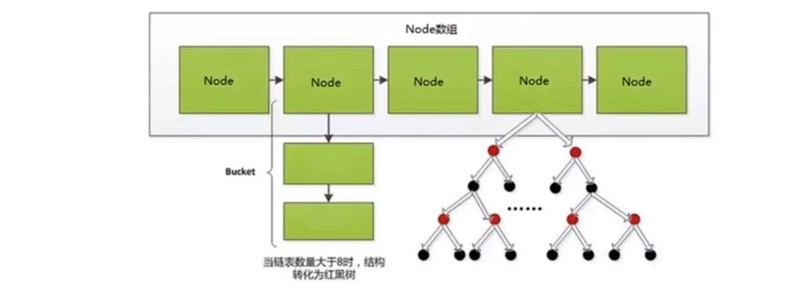

HashMap 1.7
---

数组加链表

HashMap 1.8
---

数组，链表，红黑树

hashmap中每个元素称为一个哈希桶 bucket（node + list or tree）

bucket中包含了 hash值，key，value，next

先将key进行hash，得到hash值， 根据hash值找到元素位置，判断元素是否为空。

如果为空，直接插入，不为空先判断是否为红黑树，如果是红黑树直接插入。

如果不是红黑树就是链表，判断链表长度是否大于8，且数组长度64.

如果满足这两个条件（链表长度是否大于8，且数组长度64）把链表转为红黑树，然后插入元素。

如果不满足两个条件中的任意一个（链表长度是否大于8，且数组长度64），则遍历链表进行插入（尾插法，1.8前是头插法）。

链表超过一定长度，时间复杂度达到了 O(n),而红黑树的时间复杂度是O(logn)

所以说会从链表转为红黑树

反过来，如果红黑树的节点小于等于6后，会恢复链表状态。

hash值计算

.hashCode()返回一个int类型的散列值，后面hashCode再右移16位，是32bit的一半，与自己本身做异或操作（相同为0，不同为1）

主要是为了混合hash值的高位和地位，增加低位的随机性。

hashMap为什么会出现死循环？解决方案。
---
出现死循环主要是在1.7及之前。

由于扩容时的操作是使用头插法，在多线程的环境下可能产生循环链表。

死循环是因为并发 HashMap 扩容导致的，并发扩容的第一步，线程 T1 和线程 T2 要对 HashMap 进行扩容操作，此时 T1 和 T2 指向的是链表的头结点元素 A，而 T1 和 T2 的下一个节点，也就是 T1.next 和 T2.next 指向的是 B 节点，

如下图所示：

死循环的第二步操作是，线程 T2 时间片用完进入休眠状态，而线程 T1 开始执行扩容操作，一直到线程 T1 扩容完成后，线程 T2 才被唤醒，扩容之后的场景如下图所示：

从上图可知线程 T1 执行之后，因为是头插法，所以 HashMap 的顺序已经发生了改变，但线程 T2 对于发生的一切是不可知的，所以它的指向元素依然没变，如上图展示的那样，T2 指向的是 A 元素，T2.next 指向的节点是 B 元素

当线程 T1 执行完，而线程 T2 恢复执行时，死循环就建立了，如下图所示：

因为 T1 执行完扩容之后 B 节点的下一个节点是 A，而 T2 线程指向的首节点是 A，第二个节点是 B，这个顺序刚好和 T1 扩完容完之后的节点顺序是相反的。T1 执行完之后的顺序是 B 到 A，而 T2 的顺序是 A 到 B，这样 A 节点和 B 节点就形成死循环了，这就是 HashMap 死循环导致的原因。

使用线程安全容器 ConcurrentHashMap 替代（推荐使用此方案）。

使用线程安全容器 Hashtable 替代（性能低，不建议使用）。

使用 synchronized 或 Lock 加锁 HashMap 之后，再进行操作，相当于多线程排队执行（比较麻烦，也不建议使用）。

数据覆盖问题
---
在并发情况下 对同一个位置的值写入，都会判断该位置是否为空，两个线程都判断为null时，线程1时间片用完了（变成就绪状态），线程1插入数据，结束流程。

线程2恢复运行，因为已经判断完是否为Null，此时插入数据。线程1的数据就被覆盖了。

HashTable为什么是线程安全的？
---
put，get方法都用了synchronized关键字

hash计算方法
---

key的hashcode 和 key右移16位 做 异或运算

put寻址
---

(table.length - 1) &（与运算） hash的方式得到key在table中的下标

扩容机制
---

使用默认构造方法初始化hashMap

默认初始容量16 负载因子0.75

threshold（阈值）就是12  

之后每次扩容是之前的两倍 第二次扩容32 threshold(阈值)24