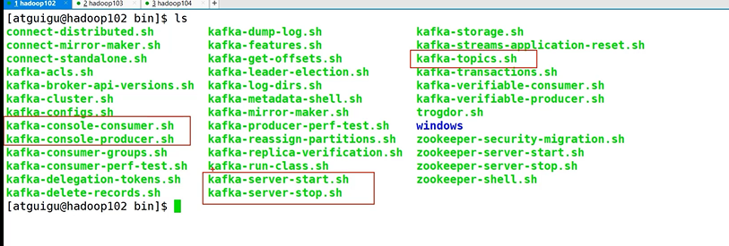
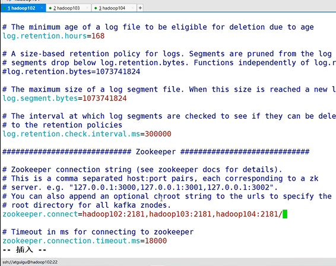
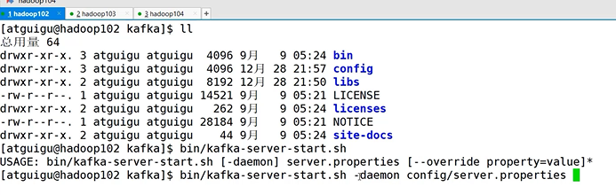

点对点模式，发布订阅模式
---

producer生产者
---

生产消息

producer （po du se） 制片人 生产者

consumer消费者
---

存储消息

partition分区
---

`partition只能增加不能减少`

消费消息

一个topic如果有100T的数据，

使用3个partition分区存储消费30T的消息，提高吞吐量，

    broker0:    topicA-partition0

    broker1:    topicA-partition1

    broker2:    topicA-partition2

一个partition分区的消息只能有一个消费者consumer消费

如果partition挂了？
---

对partition增加副本，partition有leader和follower之分

Kafka的进行消息处理时，只针对leader进行生产和消费，不使用follower

当leader挂掉后，follower有条件可以成为leader

zookeeper存储什么信息？
---

zookeeper管理着Kafka集群中哪些broker上线，正在工作。

也会记录分区中的leader是哪个 ，比如broker0中有一个partition0，broker1中也有个partition0， 

zookeeper会记录哪个是leader

`Kafka在2.8.0后，不基于zookeeper来管理broker和partition（可选模式）`

Kafka的版本问题
---

broker用Scala编写

producer和consumer使用Java编写

如kafka_2.13-3.0.0 前面的是Scala版本，后面的是Kafka版本

Kafka的脚本和配置信息
---

kafka 的broker.id必须唯一

log.dirs 并不是日志文件路径，而是数据文件路径，默认是临时目录，所以也要修改

zookeeper.connect也要修改吗，默认是localhost 要改成Hadoop的地址

指定后台启动 和指定配置文件

