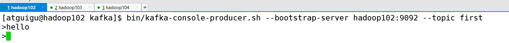
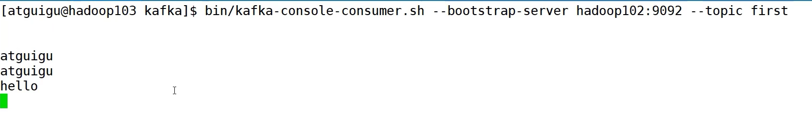

topic命令
---

    --bootstrap-server 连接Kafka 主机加端口

    --topic 操作topic的名称

    --create 创建主题

    --delete 删除主题

    --alter 修改主题

    --list 查看所有主题

    --describe 查看主题详细信息

    --partitions 设置分区数

    --replication-factor 设置分区副本

    --config 更新系统默认的配置

创建topic 指定分区 指定副本
---

执行kafka-topic.sh脚本 

`partition只能增加不能减少`

下图的leader中的数字代表这个leader所在的broker id

而replicas指的的是副本所在的broker id

`命令行不能修改分区副本数`

创建生产者
---

执行kafka-console-producer.sh脚本 

创建消费者
---

执行kafka-console-consumer.sh脚本 

生产消息

消费消息

