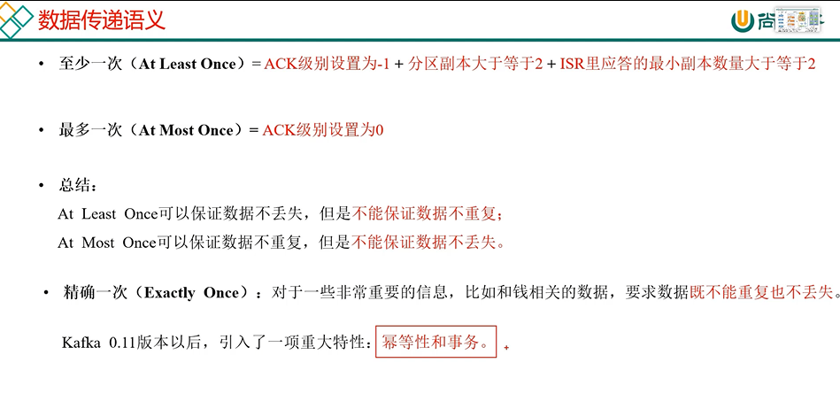
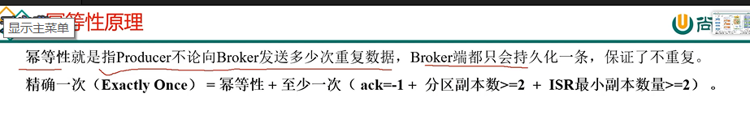
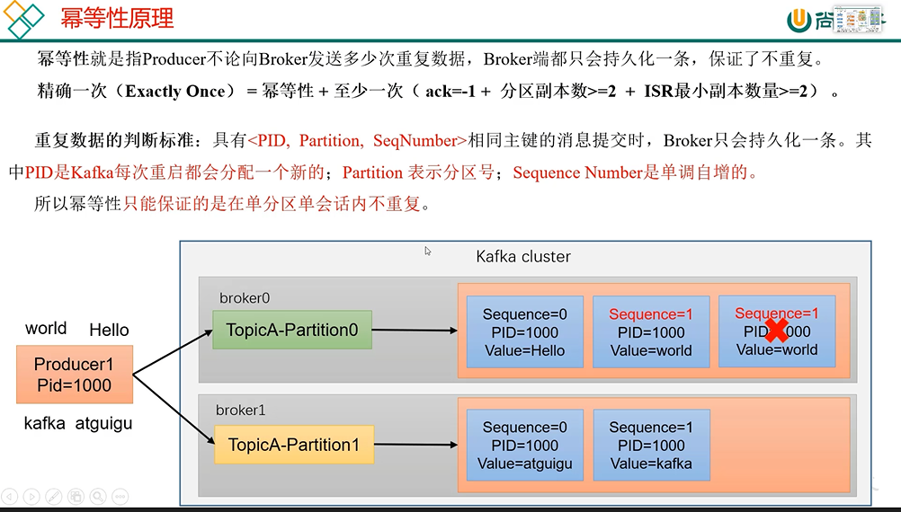
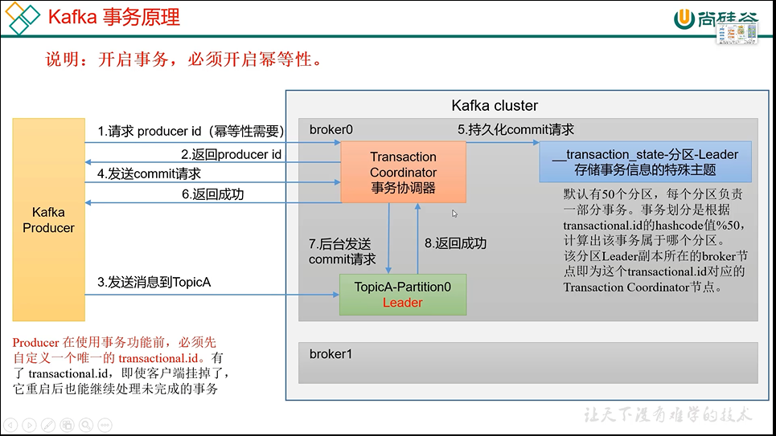
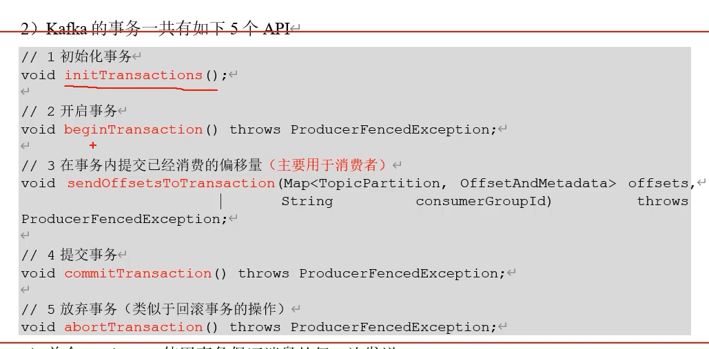

consumer至少收到一次消息
---

ACK=-1

分区副本大于等于2

ISR ACK应答分区副本数量大于等于2

producer最多发送一次
---

ACK=0

精确发送一次
---

Kafka幂等性和事务

重复数据的判断依据
---

PID,partition，seqNumber 相同的消息提交时，broker只会持久化一条

PID是Kafka每次重启都会分配一个新的 partition表示分区号，sequence Number是单调自增的

Kafka幂等性配置
---

enable。idempotence=true 默认true

Kafka事务原理
---

开启事务，必须先开启幂等性

    package com.atguigu.kafka.producer;
    
    import org.apache.kafka.clients.producer.KafkaProducer;
    import org.apache.kafka.clients.producer.ProducerConfig;
    import org.apache.kafka.clients.producer.ProducerRecord;
    import org.apache.kafka.common.serialization.StringSerializer;
    
    import java.util.Properties;
    
    public class CustomProducerTranactions {
    
        public static void main(String[] args) {
    
            // 0 配置
            Properties properties = new Properties();
    
            // 连接集群 bootstrap.servers
            properties.put(ProducerConfig.BOOTSTRAP_SERVERS_CONFIG, "hadoop102:9092,hadoop103:9092");
    
            // 指定对应的key和value的序列化类型 key.serializer
    //        properties.put(ProducerConfig.KEY_SERIALIZER_CLASS_CONFIG,"org.apache.kafka.common.serialization.StringSerializer");
    properties.put(ProducerConfig.KEY_SERIALIZER_CLASS_CONFIG, StringSerializer.class.getName());
    properties.put(ProducerConfig.VALUE_SERIALIZER_CLASS_CONFIG, StringSerializer.class.getName());
    
            // 必须指定事务id （保证全局唯一）
            properties.put(ProducerConfig.TRANSACTIONAL_ID_CONFIG, "tranactional_id_01");
    
            // 1 创建kafka生产者对象
            // "" hello
            KafkaProducer<String, String> kafkaProducer = new KafkaProducer<>(properties);
            //初始化事务
            kafkaProducer.initTransactions();
            //开启事务
            kafkaProducer.beginTransaction();
    
            try {
                // 2 发送数据
                for (int i = 0; i < 5; i++) {
                    kafkaProducer.send(new ProducerRecord<>("first", "atguigu" + i));
                }
    
                int i = 1 / 0;
                //提交事务
                kafkaProducer.commitTransaction();
            } catch (Exception e) {
                //放弃事务（类似回滚）
                kafkaProducer.abortTransaction();
            } finally {
                // 3 关闭资源
                kafkaProducer.close();
            }
        }
    }
