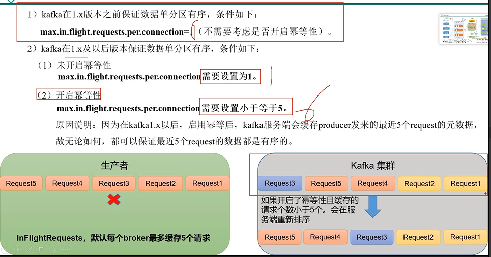

 单分区有序
---

多分区，分区与分区无序
---

在consumer做处理 做排序

但这个需要所有的消息都到达consumer才能处理，效率不高

数据乱序
---

inflight Request 默认每个broker最多缓冲5个请求

如何保证单分区有序？
---

Kafka在1.x版本前保证数据单分区有序，需要

    max.in.flight.requests.per.connection=1(每个broker只缓存一个请求)

Kafka在1.x版本后保证数据单分区有序，需要

（1） 未开启幂等性

    max.in.flight.requests.per.connection=1(每个broker只缓存一个请求)

（2） 开启幂等性（默认开启）

    max.in.flight.requests.per.connection=5(最多设置成5，也就是每个broker请求最多缓存5个)

如果开启了幂等性 并且 缓存的请求个数不大于5个 Kafka服务器会对5个request进行重新排序

