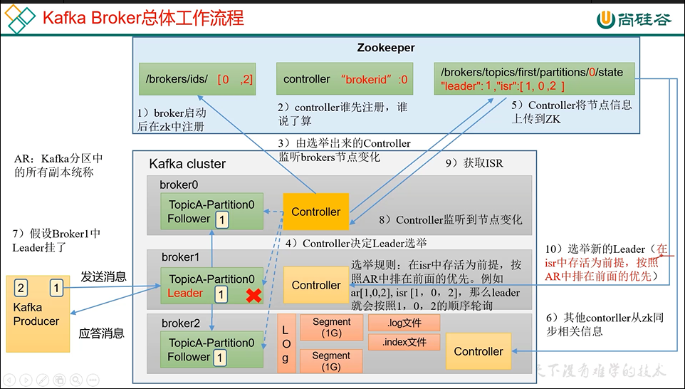

1   在broker启动后在zookeeper注册 加入/brokers/ids

2   broker竞争，在zookeeper中成为controller

3   成为controller的broker会监听zookeeper的中的ids（ids是所有的正常运行的brokerId）变化

4   成为controller的broker决定leader选举

    在isr中存活为前提，安装AR中排名的属性

    比如ar[1,0,2],isr[1,0,2] leader就按照1，0，2进行轮询

5   选举出leader信息 leader:1, isr:1,0,2  上次给zookeeper

6   其他controller从zookeeper同步备份leader信息

7   假如leader挂了

8   由选举出来的controller来监听brokers节点变化

9， 从zookeeper中拉取ar和isr

10  选举新的leader

    在isr中存活为前提，安装AR中排名的属性

    比如ar[1,0,2],isr[1,0,2] leader就按照1，0，2进行轮询

