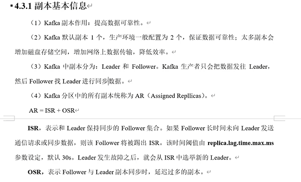
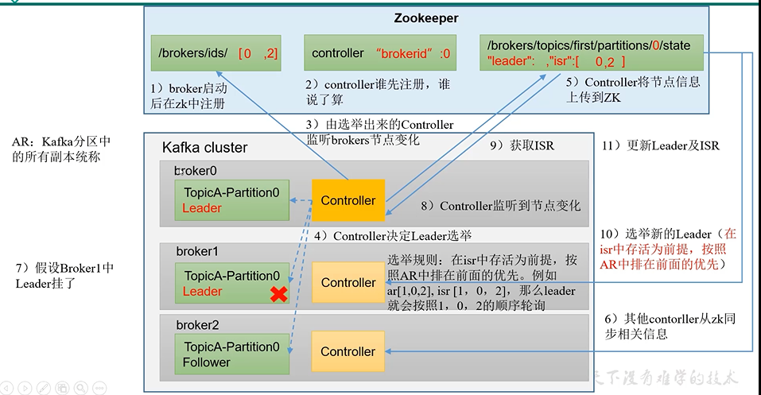
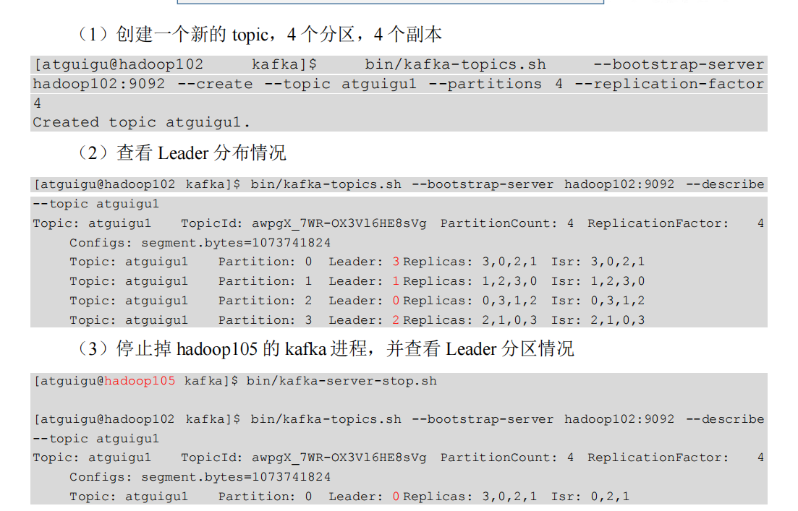
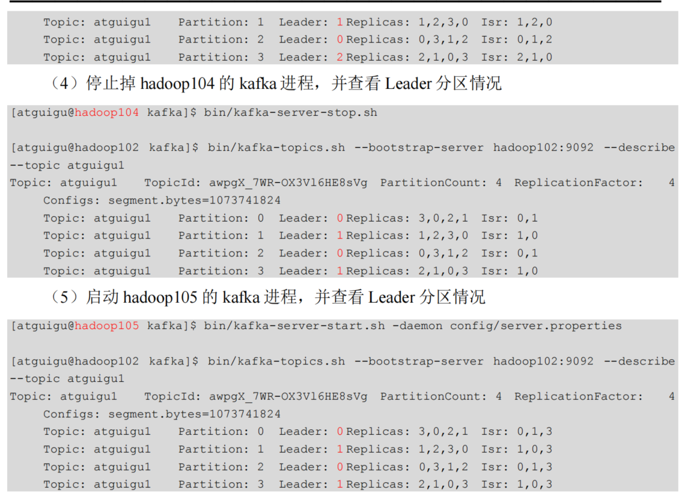
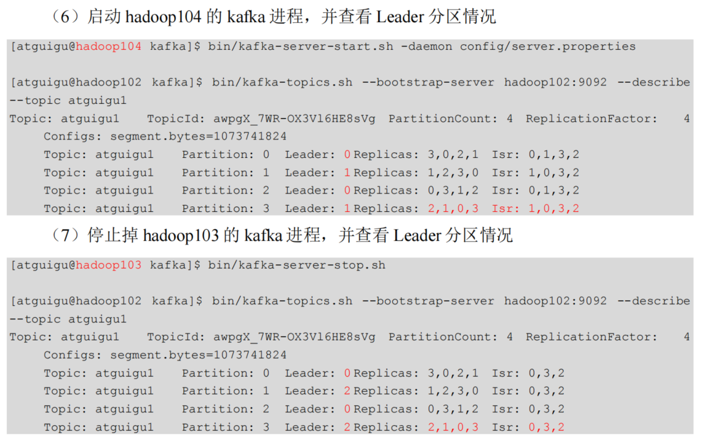

默认副本1个，生产环境一般配置2个

太多副本徒增磁盘存储容量，同步数据增加了数据传输，占用带宽

Kafka中副本分为：leader和follower，生产者和消费者只操作leader

Kafka分区的所有副本统称为AR（assigned replicas）

AR=ISR+OSR

ISR
---

    和leader保持同步的follower集合，如果follower长时间未向leader发送通信请求或者同步数据

    则该follower将被提出ISR，该时间阈值由replica.lag.time.max.ms参数设定，默认30s

    leader发生故障后，从ISR中选举新的leader

OSR
---

    follower与leader副本同步时，延迟过多的副本

leader选举(isr存活，且ar在最前面)
---

broker启动后在zookeeper注册，从broker中选举出controller来决定谁是leader

选举规则 

    在isr中存活，在AR（Kafka分区中所有副本的统称）中排名考前的的优先

选举完毕后，controller会将leader和isr的信息上传到zookeeper

leader挂掉，controller会从zookeeper中获取isr信息和ar信息，按ar总排名靠前的重新选举

