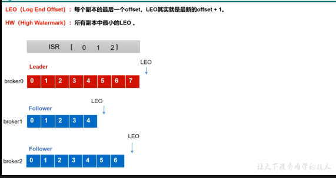

LEO(log end offset)
---

每个副本最后一个offset，LEO其实就是最新的offset+1

HW(high watermark)(高水位线)
---
所有副本中最小的LEO

下图的高水位线，就是5

图中的broker2挂掉，从isr中踢出，broker0和broker1继续工作

broker2恢复工作，读取本地文件中的上次的HW，将高于HW的部分截取掉，从HW开始向leader进行同步

等到broker2的LEO(最后一个offset大于等于该分区的high watermark)

也就是说broker2中的follower追上leader时，就可以重新加入isr

leader故障
---

leader挂掉，从isr中重新选举leader

如果新的leader的high watermark比其他的follower的high watermark低

会要求follower将多出的部分截去，从新的leader同步数据（保持数据一致性）

注意： leader故障，会导致数据丢失或者重复

