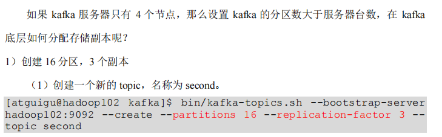
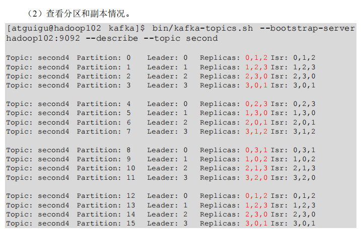
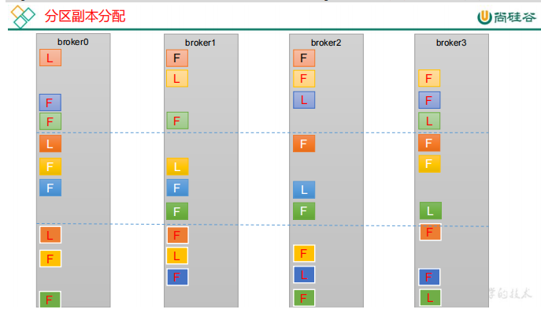
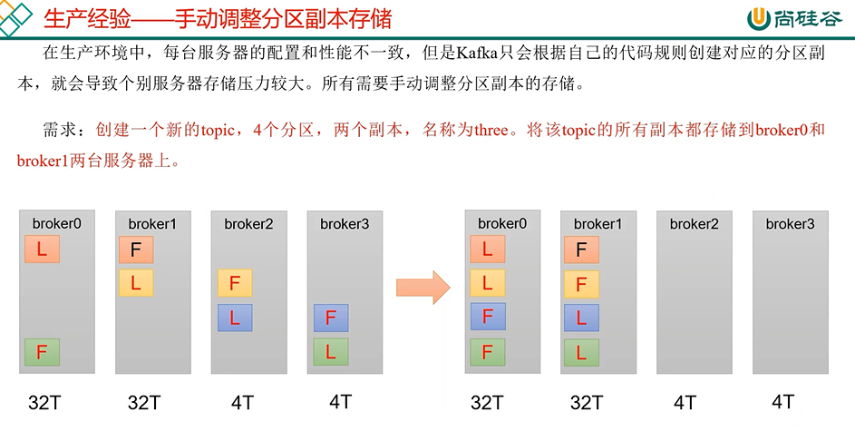
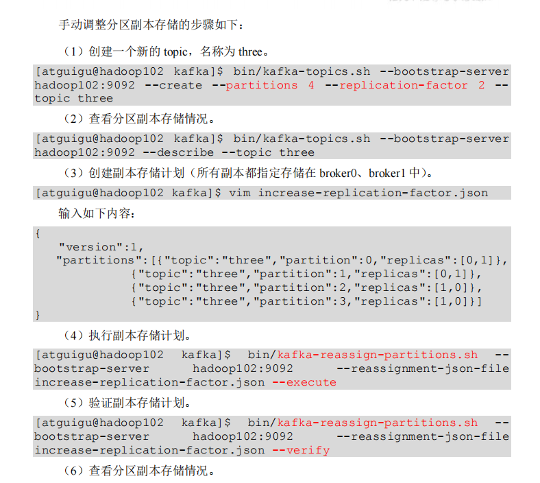
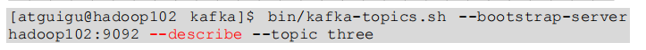
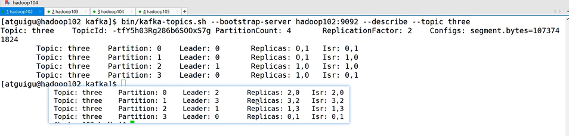

创建16个分区，3个副本

查看分区和副本情况

第一个partition 副本是连续的 如 0，1，2

第一个partition 副本是第二位留空 如 0，2，3

第三个partition 副本是第三位留空 如 0，3，1

第四个partition 副本是连续的 如 0，1，2

手动调整分区副本
---

编写一个json格式的副本存储计划文件

在文件中指定partition的副本存储的broker节点

    {
    "version":1,
    "partitions":[{"topic":"three","partition":0,"replicas":[0,1]},
    {"topic":"three","partition":1,"replicas":[0,1]},
    {"topic":"three","partition":2,"replicas":[1,0]},
    {"topic":"three","partition":3,"replicas":[1,0]}] }

