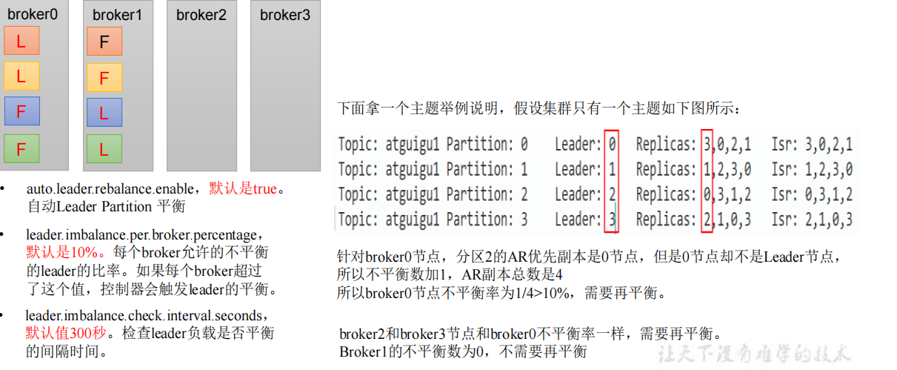
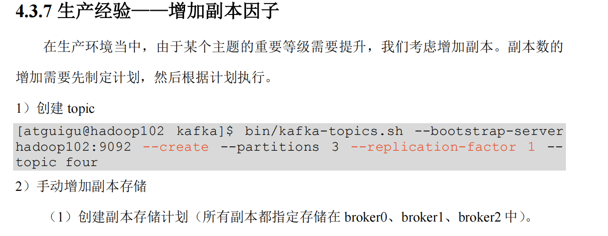
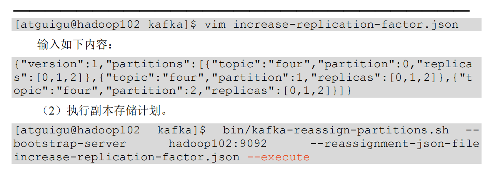

正常情况下，Kafka本身会自动把Leader Partition均匀分散在各个机器上，

来保证每台机器的读写吞吐量都是均匀的。但是如果某些broker宕机，

会导致Leader Partition过于集中在其他少部分几台broker上，

这会导致少数几台broker的读写请求压力过高，其他宕机的

broker重启之后都是follower partition，读写请求很低，造成集群负载不均衡。

自动leader.partition平衡参数
---
auto.leader.rebalance.enable=true 默认开启

    auto.leader.rebalance.enable: 

        默认是 true。 自动 Leader Partition 平衡。

        生产环境中，leader 重选举的代价比较大，可能会带来性能影响，建议设置为 false 关闭。

    leader.imbalance.per.broker.percentage:

        默认是 10%。每个 broker 允许的不平衡的 leader的比率。

        如果每个 broker 超过了这个值，控制器会触发 leader 的平衡。

分区增加副本因子
---

使用json格式的文件，vim编辑内容

    {"version":1,"partitions":[{"topic":"four","partition":0,"replica
    s":[0,1,2]},{"topic":"four","partition":1,"replicas":[0,1,2]},{"t
    opic":"four","partition":2,"replicas":[0,1,2]}]}

