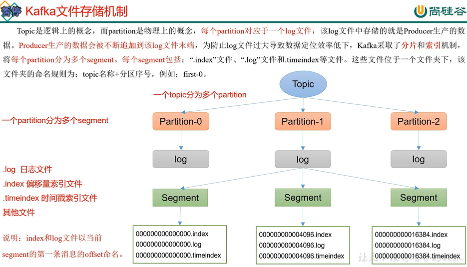

topic是逻辑上的概念，而partition是物理上的概念

每个partition都有一个log文件

producer生产的数据又不断追加到log文件末尾

为了防止log文件过大，Kafka通过分片和索引的方式

将每个partition分成了多个segment

每个segment下包含了.index文件 .log文件 .timeIndex 时间戳索引文件

Kafka默认保存7天的数据 .timeIndex文件就是判断日志保存多久的功能

index为稀疏索引 

大约每往log文件写入4kb数据，会往index文件写入一条索引

参数log.index.interval.bytes默认为4kb

index文件中保存的offset为相对offset

日志存储参数配置
---
log.segment.bytes

    Kafka 中 log 日志是分成一块块存储的，此配置是指 log 日志划分
    成块的大小，默认值 1G。

log.index.interval.bytes

    默认 4kb，kafka 里面每当写入了 4kb 大小的日志（.log），然后就
    往 index 文件里面记录一个索引。 稀疏索引。

文件清理策略
---

Kafka 中默认的日志保存时间为 7 天，可以通过调整如下参数修改保存时间

⚫ log.retention.hours，最低优先级小时，默认 7 天。

⚫ log.retention.minutes，分钟。 设置了这个小时的无效

⚫ log.retention.ms，最高优先级毫秒。 设置了这个分钟和小时的都无效

⚫ log.retention.check.interval.ms，负责设置检查周期，默认 5 分钟。