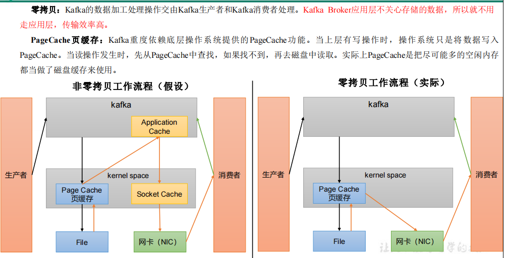

分布式集群，分区技术 topic分割成partition 提供了并行度

读取数据采用稀疏索引，快速定位要消费的数据

顺序写磁盘，写入的数据都是追加到log文件末尾 省去磁盘寻址的时间

页缓存+零拷贝技术
---

PageCache页缓存：

Kafka重度依赖底层操作系统提供的PageCache功能。

当上层有写操作时，操作系统只是将数据写入PageCache。

当读操作发生时，先从PageCache中查找，如果找不到，再去磁盘中读取。

实际上PageCache是把尽可能多的空闲内存 都当做了磁盘缓存来使用。

零拷贝：

Kafka的数据加工处理操作交由Kafka生产者和Kafka消费者处理。

Kafka Broker应用层不关心存储的数据，所以就不用走应用层，传输效率高。

