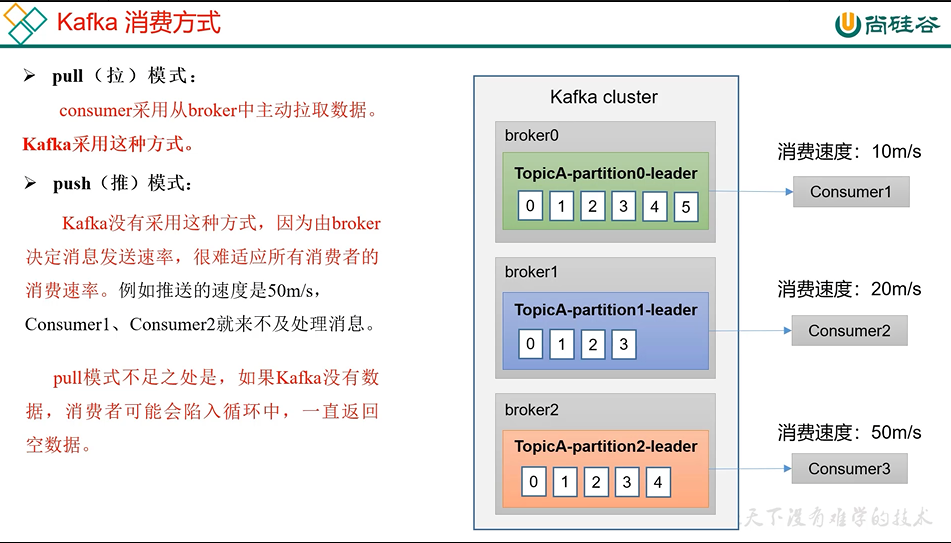
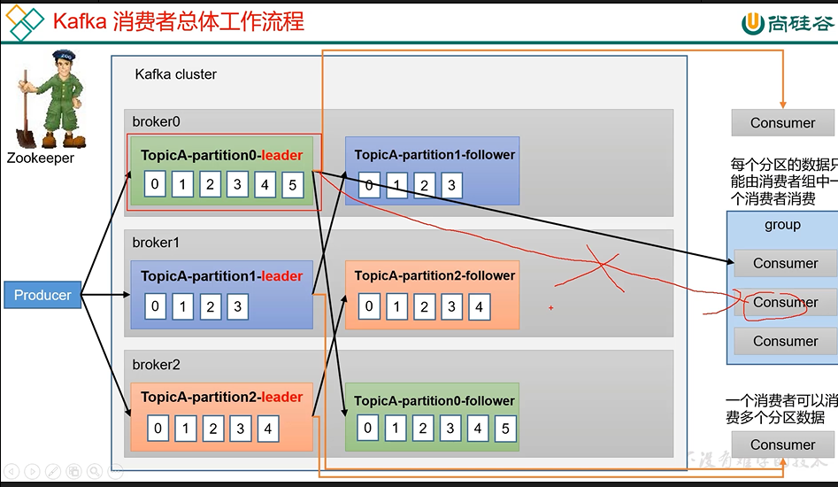
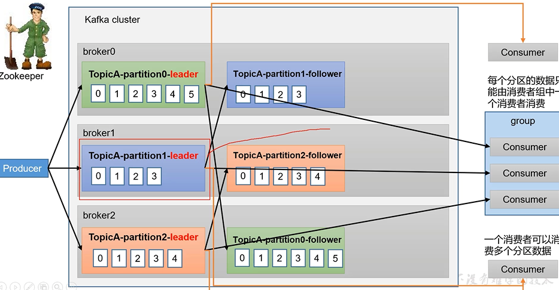

消费模式
---

因为各个consumer的消费速度不同，Kafka的broker没有采用`push`模式（主动推送）

而是用`pull`模式，consumer主动拉取broker的消息

pull模式的不足之处在于如果broker没有数据，consumer会处于一直空转的状态，浪费性能

工作流程
---

consumer主动拉取leader中的数据，一个consumer可以消费多个partition的数据

消费组和消费者之间是不冲突的

consumer group（消费组）
---

每个分区的数据只能由消费组中的一个消费者消费处理

比如说topicA-partition0-leader只能被消费者组（consumer1，consumer2）的其中一个消费 

如果说有三个分区（partition1,partition2,partition3） 消费者组（consumer1，consumer2，consumer3）

那每个消费者对应只会消费一个分区

offset
---

消费的位置

新版本的offset是每个consumer的offset由broker中的topic保存
