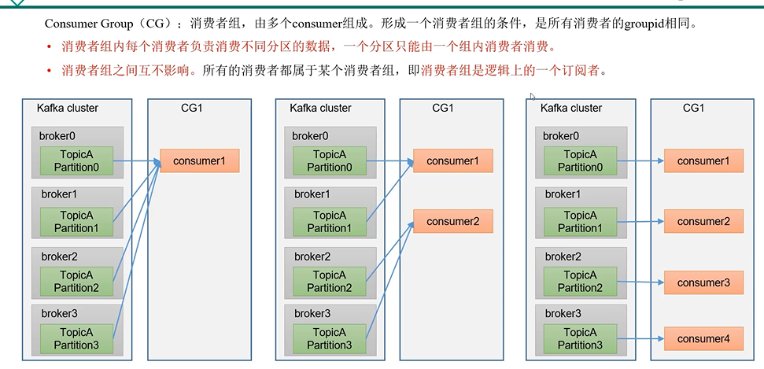
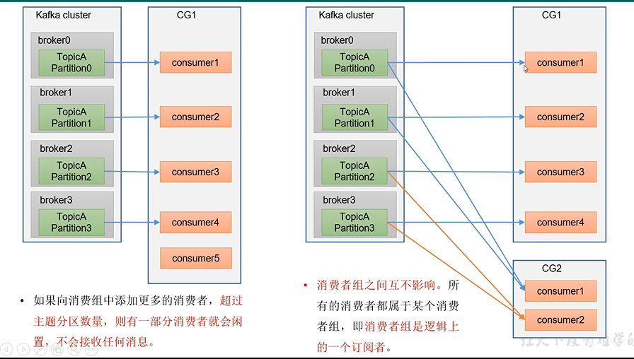
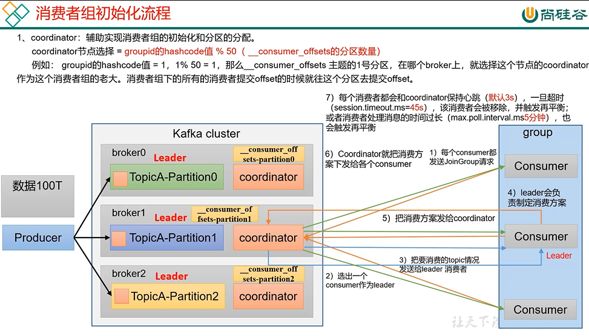

consumer group(消费组)
---

多个consumer组成，组内每个消费者消费不同的分区

消费者组和消费者组之间互不影响 即消费者组在逻辑上属于一个订阅者

如果消费组中的消费者数量超过分区数，则由一部分消费者就会闲置，不会接收任何消息

消费者组初始化流程
---

coordinator（协调者）:辅助实现消费者组的初始化和分区分配

coordinator节点选择：groupId的hashCode % 分区数量

初始化流程

    每个消费者上线和broker的coordinator通信

    coordinator选出一个consumer作为leader 把所有的consumer信息发送给这个leader

    leader制定消费方案：哪个消费者消费哪个分区，比如说三个分区个消费者怎么对应

    leader把消费方案发送给coordinator，coordinator再通知各个消费者

每个消费者都会定期和coordinator通信，保持心跳（3s），一旦超时(session.timout=45s)

该消费者就会被移除，该消费者的任务就会被其他消费者承担

或者说消费者处理消息的时间太长（max.poll.interval.ms默认5分支）也会被移除

这两种都会触发再平衡

总结说就是心跳超时（45s）和处理消息超时（5分钟）都会触发再平衡

