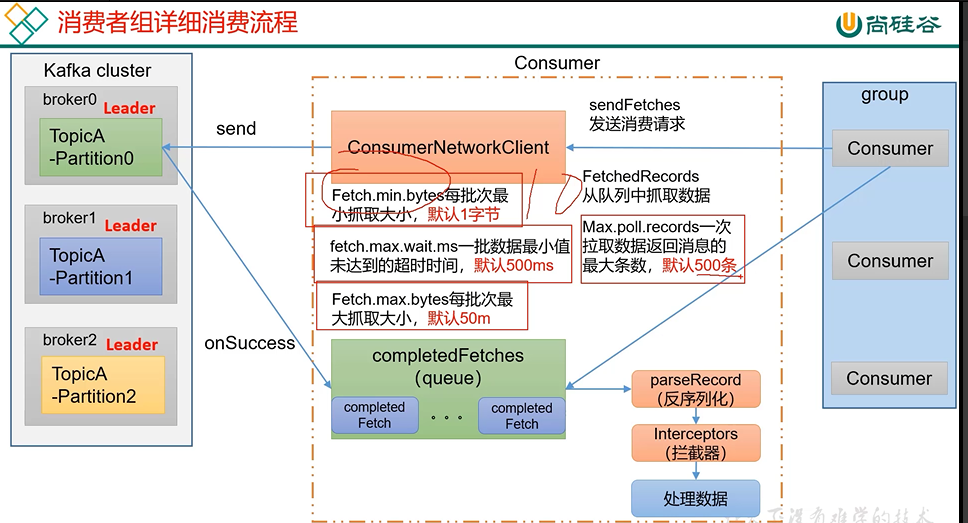

consumerNetworkClient
---

fetch.min.bytes=1 默认抓取1字节数据

    broker中分区有1字节就会抓取1字节

fetch.max.bytes=50MB 每次抓取的最大数据限制 默认50MB

fetch.max.wait.ms=500ms

    如果设置了fetch.min.bytes=10 但是producer只发送了1字节的数据到broker

    那么到了500毫秒 consumer仍然会抓取这个在broker中的1字节的数据

consumerNetworkClient会向broker发送请求

通过回调方法onSuccess获取结果

拉取的数据会放到一个队列中

而consumer会按照配置 

max.poll.records

    一次拉取数据返回信息 默认500条

来从consumerNetworkClient拉取数据

在拉取的过程首先要将数据反序列化（parseRecord） 因为broker中的数据的都是二进制的

然后会进入interceptors拦截器 可以记录进来多少数据 producer也有拦截器

最后是正常的处理数据的逻辑

