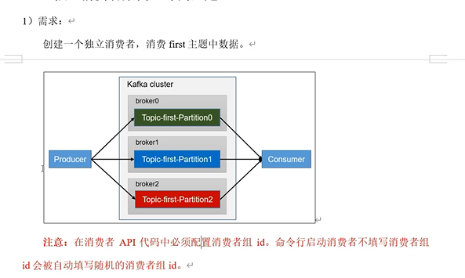
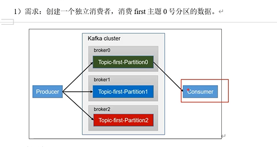

消费TOPIC
---

消费者API编写代码时必须指定groupId消费者组ID

命令行启动消费者不填写消费组ID会自动填写随机的消费组ID

示例代码
---

    package com.atguigu.kafka.consumer;
    
    import org.apache.kafka.clients.consumer.ConsumerConfig;
    import org.apache.kafka.clients.consumer.ConsumerRecord;
    import org.apache.kafka.clients.consumer.ConsumerRecords;
    import org.apache.kafka.clients.consumer.KafkaConsumer;
    import org.apache.kafka.common.serialization.StringDeserializer;
    
    import java.time.Duration;
    import java.util.ArrayList;
    import java.util.Properties;
    
    public class CustomConsumer {
    
        public static void main(String[] args) {
    
            // 0 配置
            Properties properties = new Properties();
    
            // 连接 bootstrap.servers
            properties.put(ConsumerConfig.BOOTSTRAP_SERVERS_CONFIG,"hadoop102:9092,hadoop103:9092");
    
            // 反序列化
            properties.put(ConsumerConfig.KEY_DESERIALIZER_CLASS_CONFIG, StringDeserializer.class.getName());
            properties.put(ConsumerConfig.VALUE_DESERIALIZER_CLASS_CONFIG, StringDeserializer.class.getName());
    
            // 配置消费者组id
            properties.put(ConsumerConfig.GROUP_ID_CONFIG,"test5");
    
            // 设置分区分配策略
            properties.put(ConsumerConfig.PARTITION_ASSIGNMENT_STRATEGY_CONFIG,"org.apache.kafka.clients.consumer.StickyAssignor");
    
            // 1 创建一个消费者  "", "hello"
            KafkaConsumer<String, String> kafkaConsumer = new KafkaConsumer<>(properties);
    
            // 2 订阅主题 first
            ArrayList<String> topics = new ArrayList<>();
            topics.add("first");
            kafkaConsumer.subscribe(topics);
    
            // 3 消费数据
            while (true){
    
                ConsumerRecords<String, String> consumerRecords = kafkaConsumer.poll(Duration.ofSeconds(1));
    
                for (ConsumerRecord<String, String> consumerRecord : consumerRecords) {
                    System.out.println(consumerRecord);
                }
    
                kafkaConsumer.commitAsync();
            }
        }
    }

消费分区
---

示例代码
---

    package com.atguigu.kafka.consumer;
    
    import org.apache.kafka.clients.consumer.ConsumerConfig;
    import org.apache.kafka.clients.consumer.ConsumerRecord;
    import org.apache.kafka.clients.consumer.ConsumerRecords;
    import org.apache.kafka.clients.consumer.KafkaConsumer;
    import org.apache.kafka.common.TopicPartition;
    import org.apache.kafka.common.serialization.StringDeserializer;
    
    import java.time.Duration;
    import java.util.ArrayList;
    import java.util.Properties;
    
    public class CustomConsumerPartition {
    
        public static void main(String[] args) {
            // 0 配置
            Properties properties = new Properties();
    
            // 连接
            properties.put(ConsumerConfig.BOOTSTRAP_SERVERS_CONFIG,"hadoop102:9092,hadoop103:9092");
    
            // 反序列化
            properties.put(ConsumerConfig.KEY_DESERIALIZER_CLASS_CONFIG, StringDeserializer.class.getName());
            properties.put(ConsumerConfig.VALUE_DESERIALIZER_CLASS_CONFIG, StringDeserializer.class.getName());
    
            // 组id
            properties.put(ConsumerConfig.GROUP_ID_CONFIG,"test");
    
            // 1 创建一个消费者
            KafkaConsumer<String, String> kafkaConsumer = new KafkaConsumer<>(properties);
    
            // 2 订阅主题对应的分区
            ArrayList<TopicPartition> topicPartitions = new ArrayList<>();
            topicPartitions.add(new TopicPartition("first",0));
            kafkaConsumer.assign(topicPartitions);
    
            // 3 消费数据
            while (true){
    
                ConsumerRecords<String, String> consumerRecords = kafkaConsumer.poll(Duration.ofSeconds(1));
    
                for (ConsumerRecord<String, String> consumerRecord : consumerRecords) {
                    System.out.println(consumerRecord);
                }
            }
        }
}

