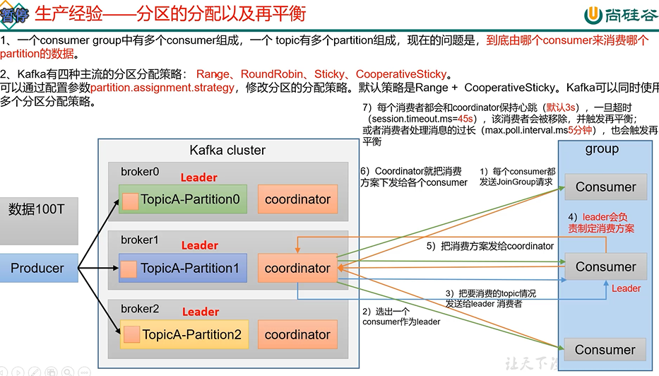
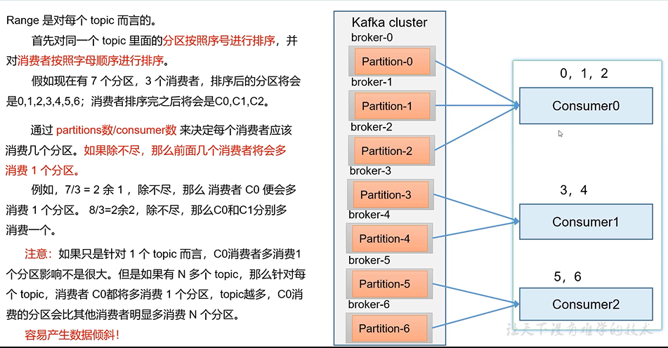

coordinator（kou wu di na te）辅助选出消费组的leader

leader决定如何分配分区的消费策略

分区分配策略 Range
---

通过partition数/consumer数

来决定每个消费者应该消费几个分区

如果除不尽前面几个消费者会将多消费一个分区

比如7个partition 3个consumer

那consumer0就会消费3个partition，consumer1和consumer2就会消费2个partition

注意

topic比较多的时候 `容易产生数据倾斜`

如果说consumer0挂掉超过45s未和coordinator通信

那么就会触发rebalance重平衡 

会将consumer0承担的三个分区（）都一块分给consumer1或者consumer2（其中一个）

那么consumer1或者consumer2其中一个就需要承担5个分区的消费 造成数据倾斜

在这个情况下，如果还有下批数据

那么consumer1和consumer2接消费下批数据时，consumer1会消费4个（0，1，2，3）

consumer2会消费3个（4，5，6）