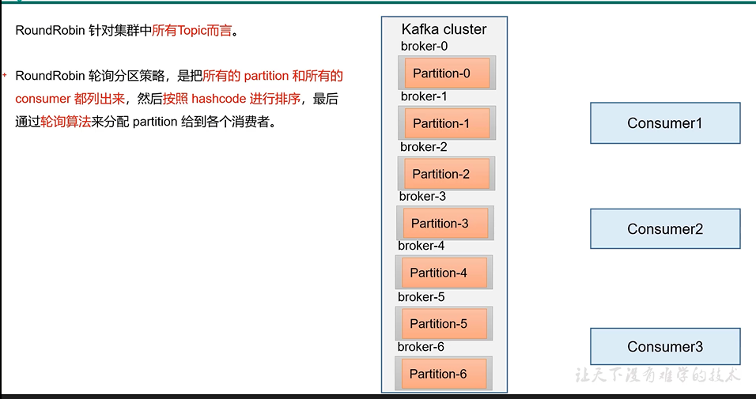
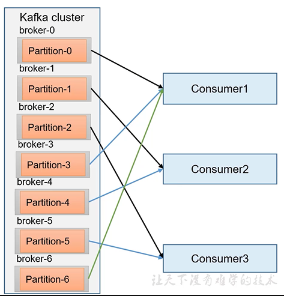
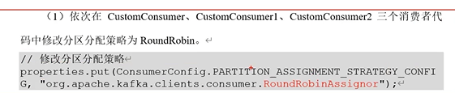
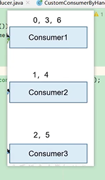

RoundRobin轮询调度
---

针对集群中所有的topic

把所有的partition和consumer都列出来

然后按照 hashcode进行排除 通过轮询算法

来分配partition给各个消费者

修改分区分配策略

    // 设置分区分配策略
    properties.put(ConsumerConfig.PARTITION_ASSIGNMENT_STRATEGY_CONFIG,
        "org.apache.kafka.clients.consumer.RoundRobinAssignor");

如下图三个consumer分别消费 {0，3，6}{1，4}{2，5} 分区

