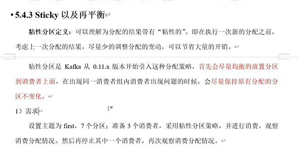
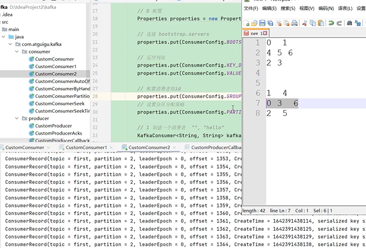

sticky（粘性分区）及再平衡
---

从.11.x引入这种分配策略

首先会尽量均衡的放置分区到消费者上面

再重新分配时  尽量保持原有的分配的分区不要变化

修改分区分配策略

    // 设置分区分配策略
    properties.put(ConsumerConfig.PARTITION_ASSIGNMENT_STRATEGY_CONFIG,
        "org.apache.kafka.clients.consumer.StickyAssignor");

首次分配分区和第二次分配分区

