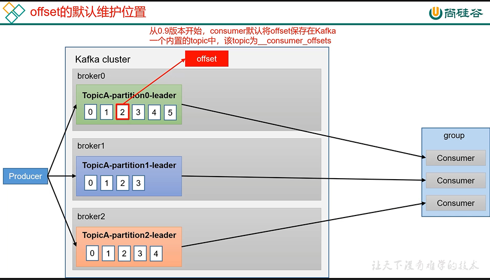
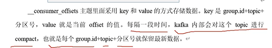
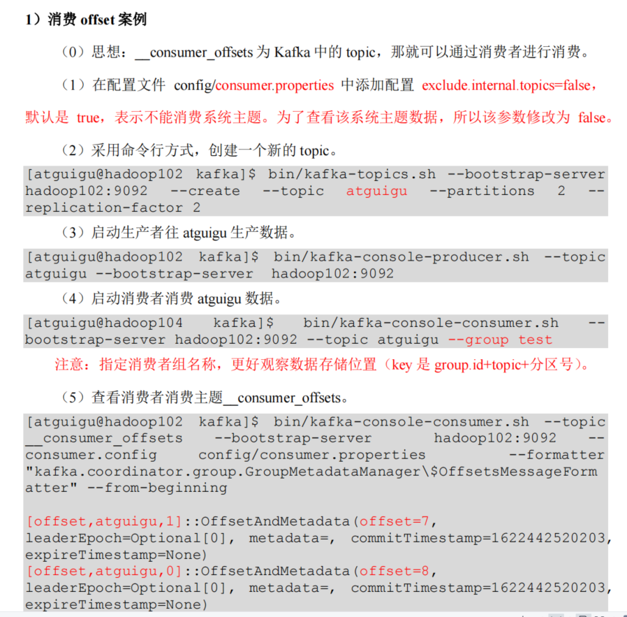
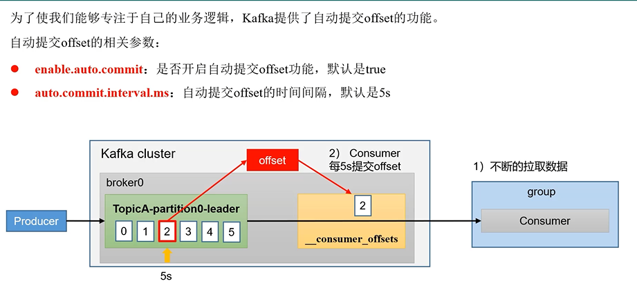
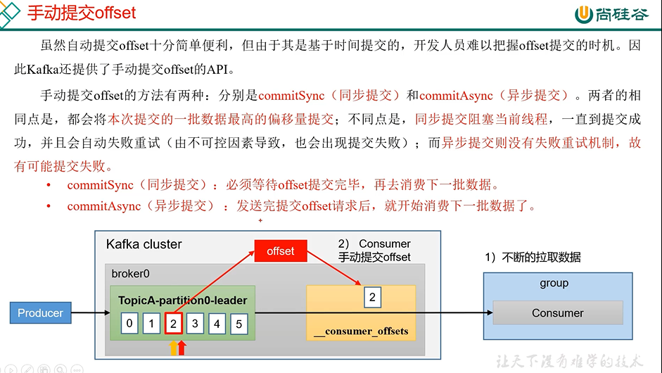
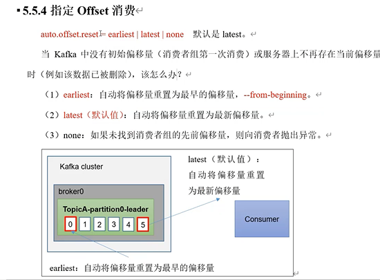

offset存放位置
---
从0.9版本开始

consumer默认将offset存储在Kafka内置的一个topic中

该topic为

    _consumer_offsets

_consumer_offsets 采用key-value形式

key是group.id + topic + partition （消费者组id+主题+分区）

value是当前的offset

每隔一段时间 Kafka会对这个topic进行compact压缩， 

也就是每个group.id + topic + partition就保留最新数据

查看consumer_offsets
---

自动提交
---

enable.auto.commit默认true 是否开启自动提交功能

auto.commit.interval.ms 自动提交offset的时间间隔，默认5s

    // 自动提交
    properties.put(ConsumerConfig.ENABLE_AUTO_COMMIT_CONFIG,true);

手动提交
---

手动提交分为两种

    commitSync(同步提交)和commitAsync(异步提交)

两者的相同点是

    都会提交本次数据最高的偏移量

不同的点是

    同步提交阻塞当前线程，一直到提交成功，自动失败重试

    同步提交必须等待offset提交完毕，再去消费下批数据

    异步提交 没有失败重试机制

    异步提交发送完offset请求后，就开始消费下一批数据了

    package com.atguigu.kafka.consumer;
    
    import org.apache.kafka.clients.consumer.ConsumerConfig;
    import org.apache.kafka.clients.consumer.ConsumerRecord;
    import org.apache.kafka.clients.consumer.ConsumerRecords;
    import org.apache.kafka.clients.consumer.KafkaConsumer;
    import org.apache.kafka.common.serialization.StringDeserializer;
    
    import java.time.Duration;
    import java.util.ArrayList;
    import java.util.Properties;
    
    public class CustomConsumerByHandSync {
    
        public static void main(String[] args) {
    
            // 0 配置
            Properties properties = new Properties();
    
            // 连接 bootstrap.servers
            properties.put(ConsumerConfig.BOOTSTRAP_SERVERS_CONFIG,"hadoop102:9092,hadoop103:9092");
    
            // 反序列化
            properties.put(ConsumerConfig.KEY_DESERIALIZER_CLASS_CONFIG, StringDeserializer.class.getName());
            properties.put(ConsumerConfig.VALUE_DESERIALIZER_CLASS_CONFIG, StringDeserializer.class.getName());
    
            // 配置消费者组id
            properties.put(ConsumerConfig.GROUP_ID_CONFIG,"test");
    
            // 手动提交
            properties.put(ConsumerConfig.ENABLE_AUTO_COMMIT_CONFIG,false);
    
            // 1 创建一个消费者  "", "hello"
            KafkaConsumer<String, String> kafkaConsumer = new KafkaConsumer<>(properties);
    
            // 2 订阅主题 first
            ArrayList<String> topics = new ArrayList<>();
            topics.add("first");
            kafkaConsumer.subscribe(topics);
    
            // 3 消费数据
            while (true){
    
                ConsumerRecords<String, String> consumerRecords = kafkaConsumer.poll(Duration.ofSeconds(1));
    
                for (ConsumerRecord<String, String> consumerRecord : consumerRecords) {
                    System.out.println(consumerRecord);
                }
    
                // 手动提交offset
                kafkaConsumer.commitSync();
                kafkaConsumer.commitAsync();
            }
        }
    }

指定offset
---

auto.offset.reset = earliest | latest | none 默认是latest

当Kafka中没有初始偏移量（消费者组第一次消费）或者服务器上不再存在当前偏移量（例如该数据已删除），该怎么办？

earliest 自动将偏移量重置为最早的偏移量（重新消费）

latest（默认值）  自动将偏移量重置为最新偏移量

none    如果未找到消费者组的先前偏移量，则向消费者抛出异常

    public static void main(String[] args) {
    
            // 0 配置信息
            Properties properties = new Properties();
    
            // 连接
            properties.put(ConsumerConfig.BOOTSTRAP_SERVERS_CONFIG,"hadoop102:9092,hadoop103:9092");
    
            // 反序列化
            properties.put(ConsumerConfig.KEY_DESERIALIZER_CLASS_CONFIG, StringDeserializer.class.getName());
            properties.put(ConsumerConfig.VALUE_DESERIALIZER_CLASS_CONFIG, StringDeserializer.class.getName());
    
            // 组id
            properties.put(ConsumerConfig.GROUP_ID_CONFIG,"test3");
    
            // 1 创建消费者
            KafkaConsumer<String, String> kafkaConsumer = new KafkaConsumer<>(properties);
    
            // 2 订阅主题
            ArrayList<String> topics = new ArrayList<>();
            topics.add("first");
            kafkaConsumer.subscribe(topics);
    
            // 指定位置进行消费
            Set<TopicPartition> assignment = kafkaConsumer.assignment();
    
            //  保证分区分配方案已经制定完毕
            while (assignment.size() == 0){
                kafkaConsumer.poll(Duration.ofSeconds(1));
    
                assignment = kafkaConsumer.assignment();
            }
    
            // 指定消费的offset
            for (TopicPartition topicPartition : assignment) {
                kafkaConsumer.seek(topicPartition,600);
            }
    
            // 3  消费数据
            while (true){
    
                ConsumerRecords<String, String> consumerRecords = kafkaConsumer.poll(Duration.ofSeconds(1));
    
                for (ConsumerRecord<String, String> consumerRecord : consumerRecords) {
    
                    System.out.println(consumerRecord);
                }
            }
        }

按时间消费offset
---

最近几小时数据异常，想按时间消费前一天的数据

    public class CustomConsumerSeekTime {
    
        public static void main(String[] args) {
    
            // 0 配置信息
            Properties properties = new Properties();
    
            // 连接
            properties.put(ConsumerConfig.BOOTSTRAP_SERVERS_CONFIG,"hadoop102:9092,hadoop103:9092");
    
            // 反序列化
            properties.put(ConsumerConfig.KEY_DESERIALIZER_CLASS_CONFIG, StringDeserializer.class.getName());
            properties.put(ConsumerConfig.VALUE_DESERIALIZER_CLASS_CONFIG, StringDeserializer.class.getName());
    
            // 组id
            properties.put(ConsumerConfig.GROUP_ID_CONFIG,"test3");
    
            // 1 创建消费者
            KafkaConsumer<String, String> kafkaConsumer = new KafkaConsumer<>(properties);
    
            // 2 订阅主题
            ArrayList<String> topics = new ArrayList<>();
            topics.add("first");
            kafkaConsumer.subscribe(topics);
    
            // 指定位置进行消费
            Set<TopicPartition> assignment = kafkaConsumer.assignment();
    
            //  保证分区分配方案已经制定完毕
            while (assignment.size() == 0){
                kafkaConsumer.poll(Duration.ofSeconds(1));
    
                assignment = kafkaConsumer.assignment();
            }
    
            // 希望把时间转换为对应的offset
            HashMap<TopicPartition, Long> topicPartitionLongHashMap = new HashMap<>();
    
            // 封装对应集合
            for (TopicPartition topicPartition : assignment) {
                topicPartitionLongHashMap.put(topicPartition,System.currentTimeMillis() - 1 * 24 * 3600 * 1000);
            }
    
            Map<TopicPartition, OffsetAndTimestamp> topicPartitionOffsetAndTimestampMap = kafkaConsumer.offsetsForTimes(topicPartitionLongHashMap);
    
            // 指定消费的offset
            for (TopicPartition topicPartition : assignment) {
    
                OffsetAndTimestamp offsetAndTimestamp = topicPartitionOffsetAndTimestampMap.get(topicPartition);
    
                kafkaConsumer.seek(topicPartition,offsetAndTimestamp.offset());
            }
    
            // 3  消费数据
            while (true){
    
                ConsumerRecords<String, String> consumerRecords = kafkaConsumer.poll(Duration.ofSeconds(1));
    
                for (ConsumerRecord<String, String> consumerRecord : consumerRecords) {
    
                    System.out.println(consumerRecord);
                }
            }
        }
    }