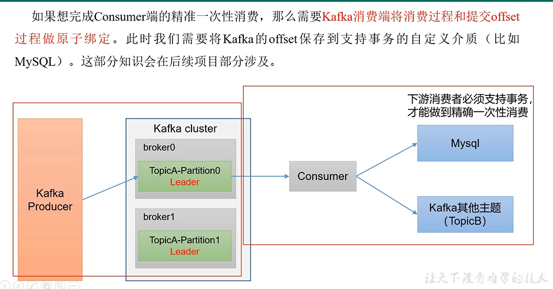
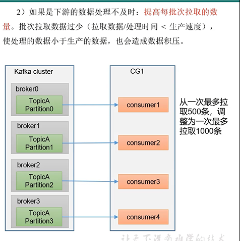

重复消费
---

自动提交offset引起

漏消费
---

设置offset为手动提交 当offset被提交时 数据还在内存未落盘

此时消费者服务挂掉，那重启后从最新的offset开始消费，未落盘的数据就丢失了

消费者事务
---

如果想完成consumer端精确消费

需要将

    Kafka消息的消费过程和提交offset做原子绑定

我们需要将Kafka的offset保存到支持事务的自定义介质（比如MySQL）

除了消费者事务外，生产者还要加上幂等性 加 事务 （ACK=-1，副本数大于等于2，ISR队列的副本数也大于等于2）

这样才能保证消息的精确一次性消费

数据积压
---

如果Kafka消费能力不足，可以考虑增加topic个数

并且同时提升消费组的消费者数量

保证

    consumer number = partition number（消费者数量=分区数量）

如果下游处理数据不及时

提高每批次拉取的数量 批次拉取的数据过少（消费速度赶不上，生产者速度）

也会造成数据积压

