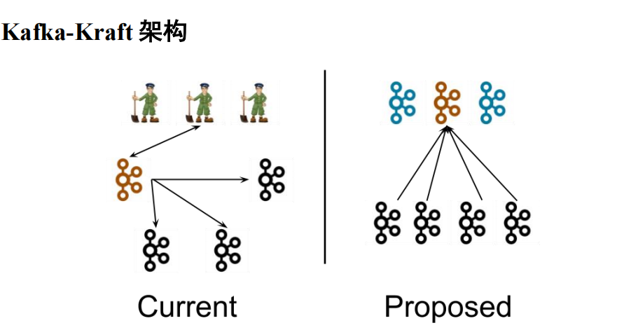

kafka-kraft模式
---

左图为 Kafka 现有架构，元数据在 zookeeper 中，运行时动态选举 controller，由
controller 进行 Kafka 集群管理。右图为 kraft 模式架构（实验性），不再依赖 zookeeper 集群，
而是用三台 controller 节点代替 zookeeper，元数据保存在 controller 中，由 controller 直接进
行 Kafka 集群管理。