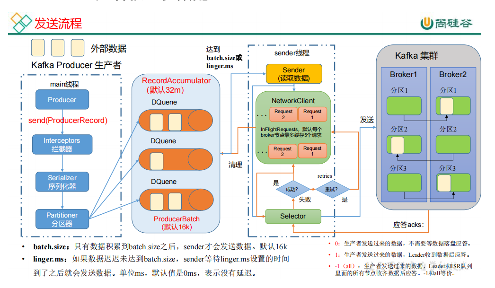

生产者参数配置
---

bootstrap.servers 

    生 产 者 连 接 集 群 所 需 的 broker 地 址 清 单 。 例 如
    hadoop102:9092,hadoop103:9092,hadoop104:9092，可以设置 1 个或者多个，中间用逗号隔开。注意这里并非需
    要所有的 broker 地址，因为生产者从给定的 broker 里查
    找到其他 broker 信息。

key.serializer 和 value.serializer 
    
    指定发送消息的 key 和 value 的序列化类型。一定要写全类名。
buffer.memory RecordAccumulator 

    缓冲区总大小，默认 32m。
batch.size 

    缓冲区一批数据最大值，默认 16k。适当增加该值，可
    以提高吞吐量，但是如果该值设置太大，会导致数据传输延迟增加。
linger.ms 

    如果数据迟迟未达到 batch.size，sender 等待 linger.time
    之后就会发送数据。单位 ms，默认值是 0ms，表示没有
    延迟。生产环境建议该值大小为 5-100ms 之间。
acks 

    0：生产者发送过来的数据，不需要等数据落盘应答。
    1：生产者发送过来的数据，Leader 收到数据后应答。
    -1（all）：生产者发送过来的数据，Leader+和 isr 队列
    里面的所有节点收齐数据后应答。默认值是-1，-1 和 all是等价的。

max.in.flight.requests.per.connection 

    允许最多没有返回 ack 的次数，默认为 5，开启幂等性要保证该值是 1-5 的数字。

retries 

    当消息发送出现错误的时候，系统会重发消息。retries 表 示重试次数。默认是 int 最大值，2147483647。
    如果设置了重试，还想保证消息的有序性，需要设置MAX_IN_FLIGHT_REQUESTS_PER_CONNECTION=1
    否则在重试此失败消息的时候，其他的消息可能发送成功了。

retry.backoff.ms 
    
    两次重试之间的时间间隔，默认是 100ms。
enable.idempotence 

    是否开启幂等性，默认 true，开启幂等性。
compression.type 

    生产者发送的所有数据的压缩方式。默认是 none，也就是不压缩。

生产者如何提高吞吐量
---

buffer.memory RecordAccumulator 

    缓冲区总大小，默认 32m。
batch.size 

    缓冲区一批数据最大值，默认 16k。适当增加该值，可
    以提高吞吐量，但是如果该值设置太大，会导致数据传输延迟增加。
linger.ms 

    如果数据迟迟未达到 batch.size，sender 等待 linger.time
    之后就会发送数据。单位 ms，默认值是 0ms，表示没有
    延迟。生产环境建议该值大小为 5-100ms 之间。
compression.type 

    生产者发送的所有数据的压缩方式。默认是 none，也就是不压缩。
    支持压缩类型：none、gzip、snappy、lz4 和 zstd。

数据可靠性
---

acks

    0：生产者发送过来的数据，不需要等数据落盘应答。
    1：生产者发送过来的数据，Leader 收到数据后应答。
    -1（all）：生产者发送过来的数据，Leader+和 isr 队列
    里面的所有节点收齐数据后应答。默认值是-1，-1 和 all
    是等价的。

至少一次（At Least Once）= ACK 级别设置为-1 + 分区副本大于等于 2 + ISR 里应

答的最小副本数量大于等于 2

数据去重
---

enable.idempotence 

    是否开启幂等性，默认 true，表示开启幂等性。

数据有序
---

单分区内，有序（有条件的，不能乱序）；多分区，分区与分区间无序；

数据乱序
---

enable.idempotence 

    是否开启幂等性，默认 true，表示开启幂等性。
max.in.flight.requests.per.connection 

    允许最多没有返回 ack 的次数，默认为 5，开启幂等性
    要保证该值是 1-5 的数字