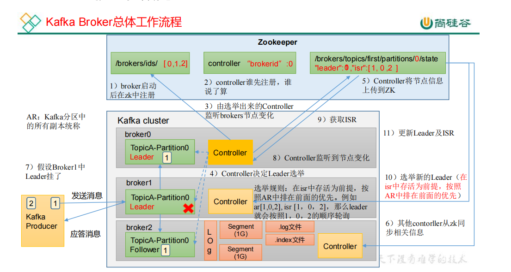

replica.lag.time.max.ms 

    ISR 中，如果 Follower 长时间未向 Leader 发送通
    信请求或同步数据，则该 Follower 将被踢出 ISR。
    该时间阈值，默认 30s。
auto.leader.rebalance.enable 

    默认是 true。 自动 Leader Partition 平衡。建议关闭。
    leader.imbalance.per.broker.percentage 默认是 10%。每个 broker 允许的不平衡的 leader
    的比率。如果每个 broker 超过了这个值，控制器
    会触发 leader 的平衡。
leader.imbalance.check.interval.seconds 

    默认值 300 秒。检查 leader 负载是否平衡的间隔时间。
log.segment.bytes

    Kafka 中 log 日志是分成一块块存储的，此配置
    是指 log 日志划分 成块的大小，默认值 1G。

log.index.interval.bytes 

    默认 4kb，kafka 里面每当写入了 4kb 大小的日志
    （.log），然后就往 index 文件里面记录一个索引。
log.retention.hours 

    Kafka中数据保存的时间，默认 7 天。
log.retention.minutes 

    Kafka中数据保存的时间，分钟级别，默认关闭。
log.retention.ms 

    Kafka中数据保存的时间，毫秒级别，默认关闭。
log.retention.check.interval.ms 

    检查数据是否保存超时的间隔，默认是 5 分钟。
log.retention.bytes 

    默认等于-1，表示无穷大。超过设置的所有日志总大小，删除最早的 segment。
log.cleanup.policy 

    默认是 delete，表示所有数据启用删除策略；
    如果设置值为 compact，表示所有数据启用压缩策略。
num.io.threads 

    默认是 8。负责写磁盘的线程数。整个参数值要占总核数的 50%。 

num.replica.fetchers 

    默认是 1。副本拉取线程数，这个参数占总核数的 50%的 1/3
num.network.threads 

    默认是 3。数据传输线程数，这个参数占总核数的 50%的 2/3 。
log.flush.interval.messages 

    强制页缓存刷写到磁盘的条数，默认是 long 的最
    大值，9223372036854775807。一般不建议修改，
    交给系统自己管理。
log.flush.interval.ms 

    每隔多久，刷数据到磁盘，默认是 null。一般不
    建议修改，交给系统自己管理。