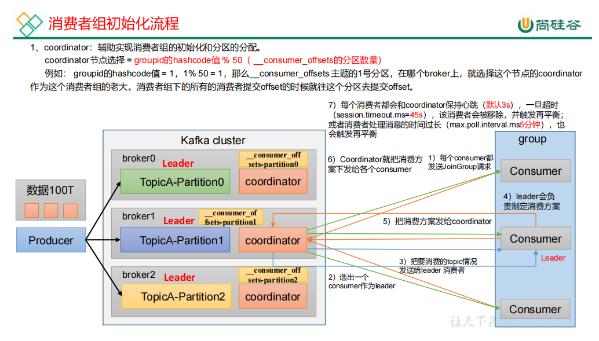
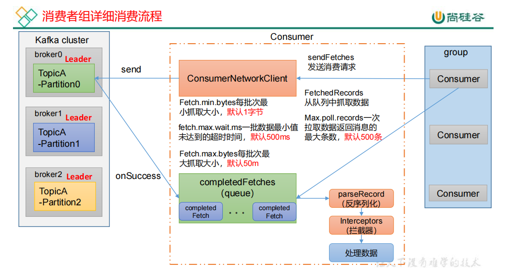

消费者初始化流程
---

消费者详细消费流程
---

bootstrap.servers 

    向 Kafka 集群建立初始连接用到的 host/port 列表。

key.deserializer 和 value.deserializer

    指定接收消息的 key 和 value 的反序列化类型。一定要写全
    类名。
group.id 

    标记消费者所属的消费者组。
enable.auto.commit 

    默认值为 true，消费者会自动周期性地向服务器提交偏移量。
auto.commit.interval.ms 

    如果设置了 enable.auto.commit 的值为 true， 则该值定义了
    消费者偏移量向 Kafka 提交的频率，默认 5s。
auto.offset.reset 

    当 Kafka 中没有初始偏移量或当前偏移量在服务器中不存在
    （如，数据被删除了），该如何处理？ earliest：自动重置偏
    移量到最早的偏移量。 latest：默认，自动重置偏移量为最新
    的偏移量。 none：如果消费组原来的（previous）偏移量不
    存在，则向消费者抛异常。 anything：向消费者抛异常。
offsets.topic.num.partitions 

    __consumer_offsets 的分区数，默认是 50 个分区。不建议修改。

heartbeat.interval.ms 

    Kafka 消费者和 coordinator 之间的心跳时间，默认 3s。
    该条目的值必须小于 session.timeout.ms ，也不应该高于
    session.timeout.ms 的 1/3。不建议修改。
    session.timeout.ms Kafka 消费者和 coordinator 之间连接超时时间，默认 45s。超
    过该值，该消费者被移除，消费者组执行再平衡。

max.poll.interval.ms 

    消费者处理消息的最大时长，默认是 5 分钟。超过该值，该
    消费者被移除，消费者组执行再平衡。
fetch.min.bytes 

    默认 1 个字节。消费者获取服务器端一批消息最小的字节数。
fetch.max.wait.ms 

    默认 500ms。如果没有从服务器端获取到一批数据的最小字节数。该时间到，仍然会返回数据。
fetch.max.bytes 

    默认 Default: 52428800（50 m）。消费者获取服务器端一批
    消息最大的字节数。如果服务器端一批次的数据大于该值
    （50m）仍然可以拉取回来这批数据，因此，这不是一个绝
    对最大值。一批次的大小受 message.max.bytes （broker
    config）or max.message.bytes （topic config）影响。
max.poll.records 

    一次 poll 拉取数据返回消息的最大条数，默认是 500 条。