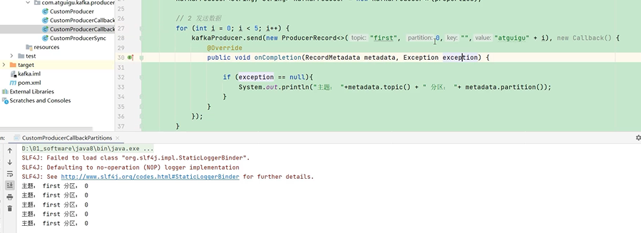

如果有100T数据，partition分区可以切割这些数据

然后存储在多台broker上

同一个topic producer生产者以partition分区为单位发送数据，

consumer消费者以partition分区为单位消费数据，提高吞吐量

默认分区器 default partitioner
---

如果指定了分区 往指定分区发送

如果没有指定分区 使用key.hashCode() % 分区数 进行取模后 确定是哪个分区

如果没指定分区 也没有设定key 那就使用 sticky partition（粘性分区）

    随机选择一个分区 如果该分区的batch已满或者linger.ms（逗留时间到了，没满也发车）时间到了 

    Kafka再随机选一个分区（和上一个不同）进行使用

示例代码
---

指定分区

指定key进行取模

    package com.atguigu.kafka.producer;
    import org.apache.kafka.clients.producer.*;
    import org.apache.kafka.common.serialization.StringSerializer;
    
    import java.util.Properties;
    
    public class CustomProducerCallbackPartitions {
    
        public static void main(String[] args) throws InterruptedException {
    
            // 0 配置
            Properties properties = new Properties();
    
            // 连接集群 bootstrap.servers
            properties.put(ProducerConfig.BOOTSTRAP_SERVERS_CONFIG,"hadoop102:9092,hadoop103:9092");
    
            // 指定对应的key和value的序列化类型 key.serializer
    //        properties.put(ProducerConfig.KEY_SERIALIZER_CLASS_CONFIG,"org.apache.kafka.common.serialization.StringSerializer");
    properties.put(ProducerConfig.KEY_SERIALIZER_CLASS_CONFIG, StringSerializer.class.getName());
    properties.put(ProducerConfig.VALUE_SERIALIZER_CLASS_CONFIG,StringSerializer.class.getName());
    
            // 关联自定义分区器
            properties.put(ProducerConfig.PARTITIONER_CLASS_CONFIG,"com.atguigu.kafka.producer.MyPartitioner");
    
            // 1 创建kafka生产者对象
            // "" hello
            KafkaProducer<String, String> kafkaProducer = new KafkaProducer<>(properties);
    
            // 2 发送数据
            for (int i = 0; i < 5; i++) {
                kafkaProducer.send(new ProducerRecord<>("first", 1,"","hello" + i), new Callback() {
                    @Override
                    public void onCompletion(RecordMetadata metadata, Exception exception) {
    
                        if (exception == null){
                            System.out.println("主题： "+metadata.topic() + " 分区： "+ metadata.partition());
                        }
                    }
                });
    
                Thread.sleep(2);
            }
    
            // 3 关闭资源
            kafkaProducer.close();
        }
    }

指定key进行取模的实现场景
---

数据库如果有张订单表，如果想把订单表的数据发送给指定的一个分区

只需要在send方法上的key设置为这个订单表的表名即可

