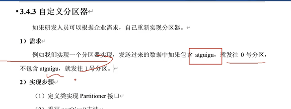

自定义分区器
---

如果数据包含了某些数据，如atguigu，指定发送给partition1分区

实现Partitioner接口

    package com.atguigu.kafka.producer;
    
    import org.apache.kafka.clients.producer.Partitioner;
    import org.apache.kafka.common.Cluster;
    
    import java.util.Map;
    
    public class MyPartitioner implements Partitioner {
    @Override
    public int partition(String topic, Object key, byte[] keyBytes, Object value, byte[] valueBytes, Cluster cluster) {
    
            // 获取数据 atguigu  hello
            String msgValues = value.toString();
    
            int partition;
    
            if (msgValues.contains("atguigu")){
                partition = 0;
            }else {
                partition = 1;
            }
    
            return partition;
        }
    
        @Override
        public void close() {
    
        }
    
        @Override
        public void configure(Map<String, ?> configs) {
    
        }
    }