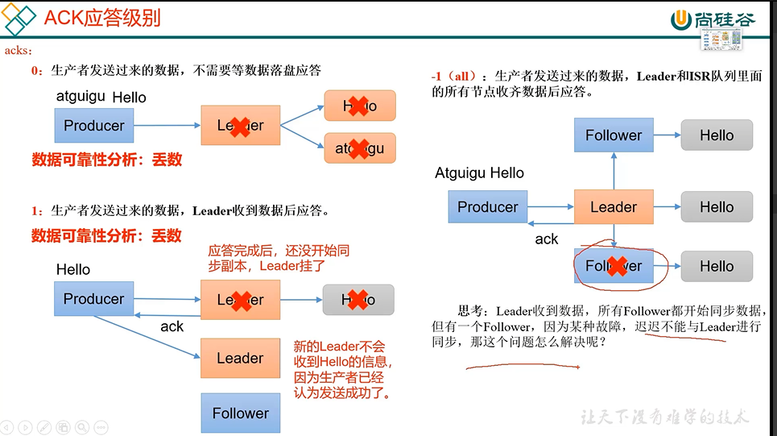
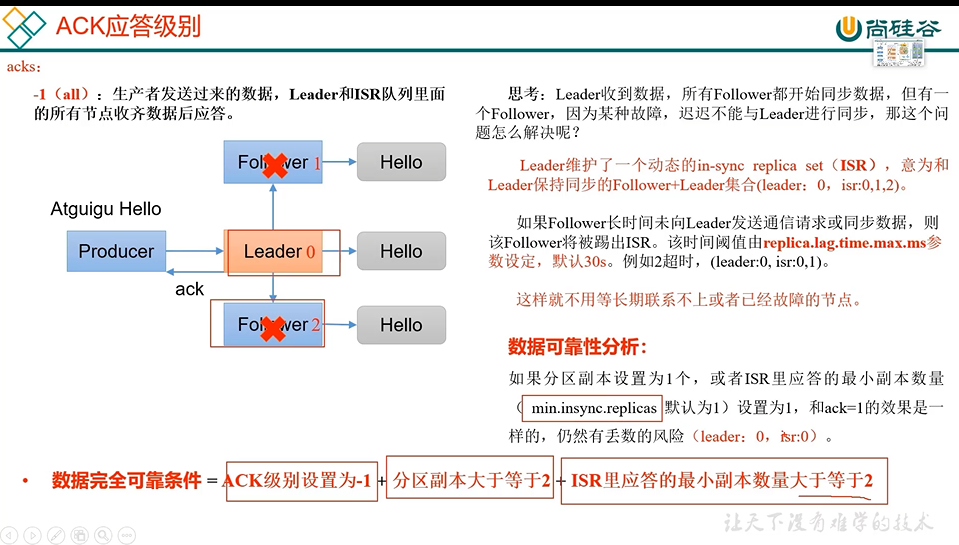
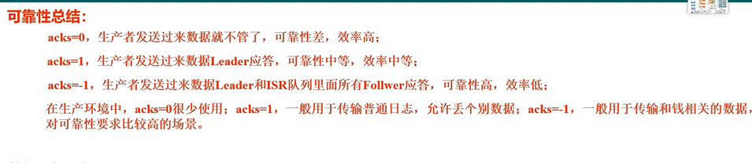

ACK应答级别
---

代表生产者发送过来的数据，不需要等待数据落盘就应答

    leader挂了数据就没了

代表生产者发送过来的数据，leader收到数据并落盘后，即使副本没同步完成，就应答

    leader挂了 数据没同步到follower 数据丢失 

-1（all） 生产者发送过来的数据，leader和ISR队列（或者说leader和所有的follower都收到了且落盘）

里面的所有节点收齐数据后应答。-1和all等价

    如果follower挂掉，不能与leader同步，那就无法应答

ISR( in-sync replica set)同步副本集合
---

如果follower长时间不和leader通信和同步，就被剔除ISR，默认30s

如果follower都挂了 isr中只会有一个leader的brokerId了

min.insync.replicas (isr应答的最小副本数量吗，默认为1)
---

所以要设置`min.insync.replicas`大于等于2，默认是2

数据完全可靠性
---

ACK级别设置为-1

分区副本大于等2

ISR里应答的最小副本数大于等于2

ACK可靠性
---

示例代码
---

    package com.atguigu.kafka.producer;
    import org.apache.kafka.clients.producer.KafkaProducer;
    import org.apache.kafka.clients.producer.ProducerConfig;
    import org.apache.kafka.clients.producer.ProducerRecord;
    import org.apache.kafka.common.serialization.StringSerializer;
    
    import java.util.Properties;
    
    public class CustomProducerAcks {
    
        public static void main(String[] args) {
    
            // 0 配置
            Properties properties = new Properties();
    
            // 连接集群 bootstrap.servers
            properties.put(ProducerConfig.BOOTSTRAP_SERVERS_CONFIG,"hadoop102:9092,hadoop103:9092");
    
            // 指定对应的key和value的序列化类型 key.serializer
    //        properties.put(ProducerConfig.KEY_SERIALIZER_CLASS_CONFIG,"org.apache.kafka.common.serialization.StringSerializer");
    properties.put(ProducerConfig.KEY_SERIALIZER_CLASS_CONFIG, StringSerializer.class.getName());
    properties.put(ProducerConfig.VALUE_SERIALIZER_CLASS_CONFIG,StringSerializer.class.getName());
    
            // acks
            properties.put(ProducerConfig.ACKS_CONFIG,"1");
    
            // 重试次数
            properties.put(ProducerConfig.RETRIES_CONFIG,3);
    
            // 1 创建kafka生产者对象
            // "" hello
            KafkaProducer<String, String> kafkaProducer = new KafkaProducer<>(properties);
    
            // 2 发送数据
            for (int i = 0; i < 5; i++) {
                kafkaProducer.send(new ProducerRecord<>("first","atguigu"+i));
            }
    
            // 3 关闭资源
            kafkaProducer.close();
        }
    }
