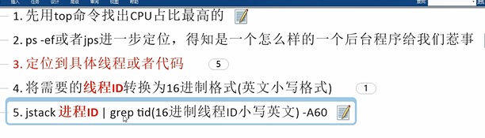
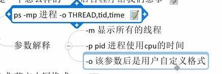
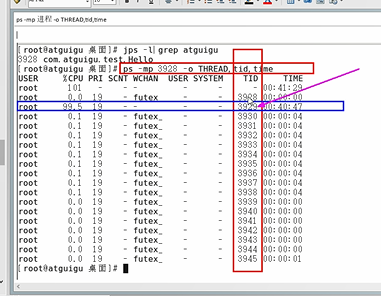
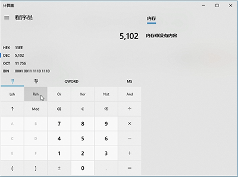
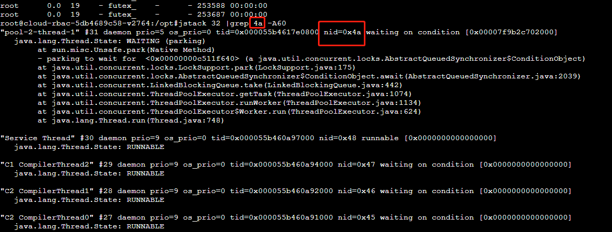

定位流程
---

定位到具体线程和代码
---

    ps -mp {进程ID} -o THREAD,tid,time

将线程ID转换成16进制格式（英文小写格式）
---

    print "%x\n" {有问题的线程ID}

或者使用电脑的计算器做转换（下图的HEX 13ee 就是 5102的十六进制）

jstack 进程ID | grep tid(16进制格式（英文小写格式）) -A60
---

