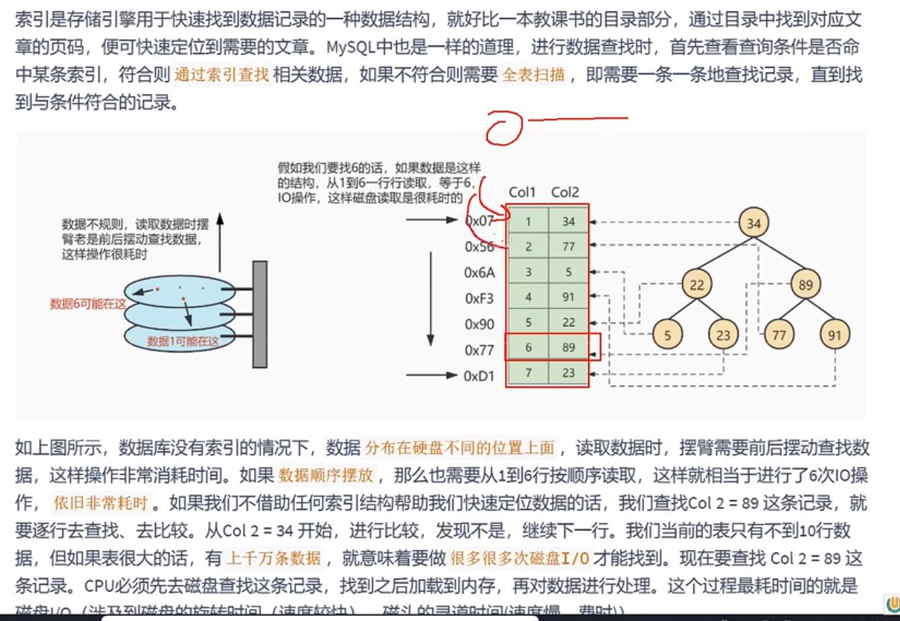
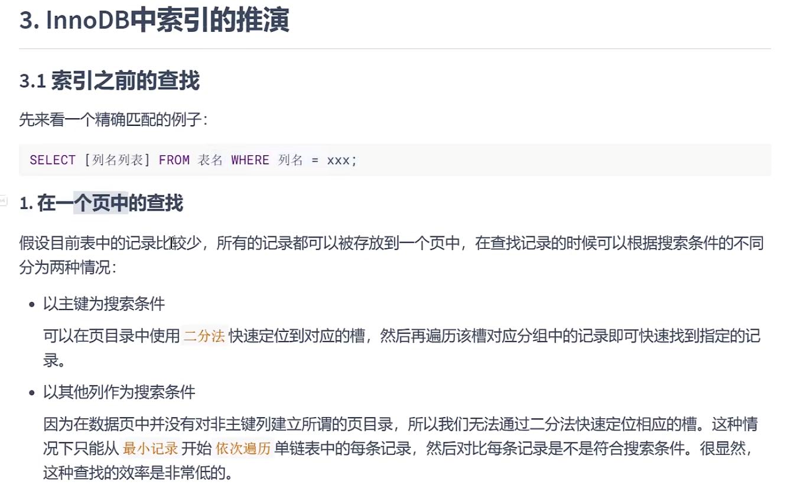

索引类似新华字典的目录，目的是避免全表扫描。

如图中从1到6，6次IO, 整个时间复杂度也是O（n）级别的

改为二叉搜索树后，使用二分查找法。提高效率 O（log n），**主要减少了磁盘IO次数**。

索引由存储引擎实现，每个存储引擎的索引不完全相同。

存储引擎可以定义每个表的**最大索引树**，和 **最大索引长度**

存储引擎支持每个表至少16个索引，总索引长度至少为256字节。

优点
---

提高检索效率，降低**数据库的IO次数**

创建唯一索引，保证每一行的**数据唯一性**

对有关系的子表和父表，联合查询提高查询速度

分组（group by）和排序子句（order by）的数据查询 显著**减少查询中分组和排序的时间** 降低CPU的消耗。

缺点
---

创建和维护索引要**耗费时间** 数据量越多，耗费时间越长。

索引需要占用**磁盘空间** 索引会占用物理空间，**存储在磁盘**

索引可能显著提高查询速度，但是会**降低更新表的速度** 对表中数据的增加，更新，删除时，索引也要动态维护。

像根据主键查询，因为是有序的，使用二分法 时间复杂度是O(logn)

如果是日期类型的无序，依次遍历 就需要 O(n)

数据地址在物理上不是连续的，所以数据关系在逻辑上就用单链表来维护顺序关系。

数据量较少时一页(**一页的大小是16KB**)就可以记录所有数据，但如果是多页的话。

搜索要一页一页的往下遍历，还要记录当前页的上一页，下一页的关系。

就得使用双向链表，因为要遍历所有的数据页，这种方式就显得超级耗时。

record_type 记录的类型

next_record 下一条数据的地址

每页中的数据必然有个recordType=2（最小记录），和recordType=3（最大记录）

页与页的关系也是用双向链表的结构来维护

如果超过了数据插入超过一页的容量（16KB）,在第一页和第二页的操作就会产生**记录移动**和**页分裂**的情况

给所有页建立目录项
---

用目录项维护页数的关系和每页的最小值。这个目录就有个别名，**索引**。