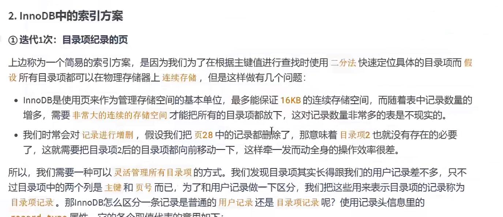
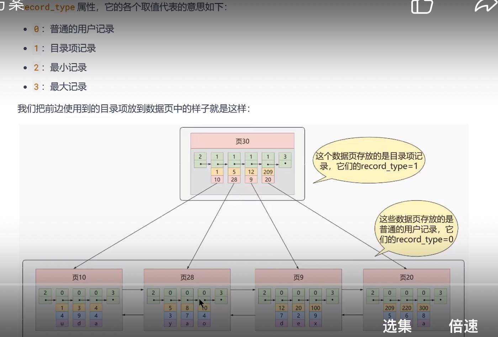
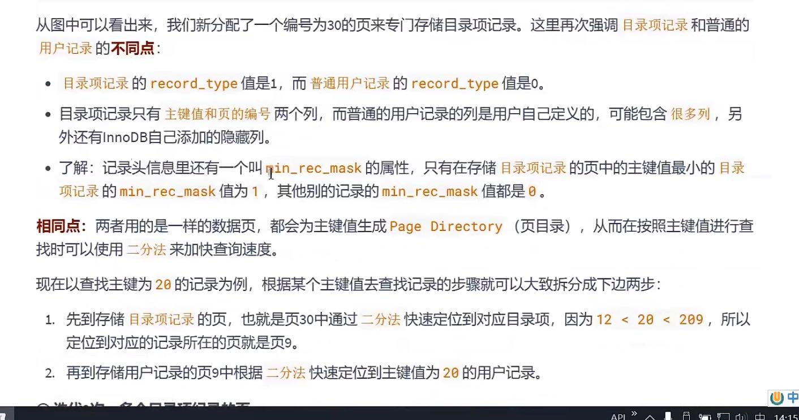
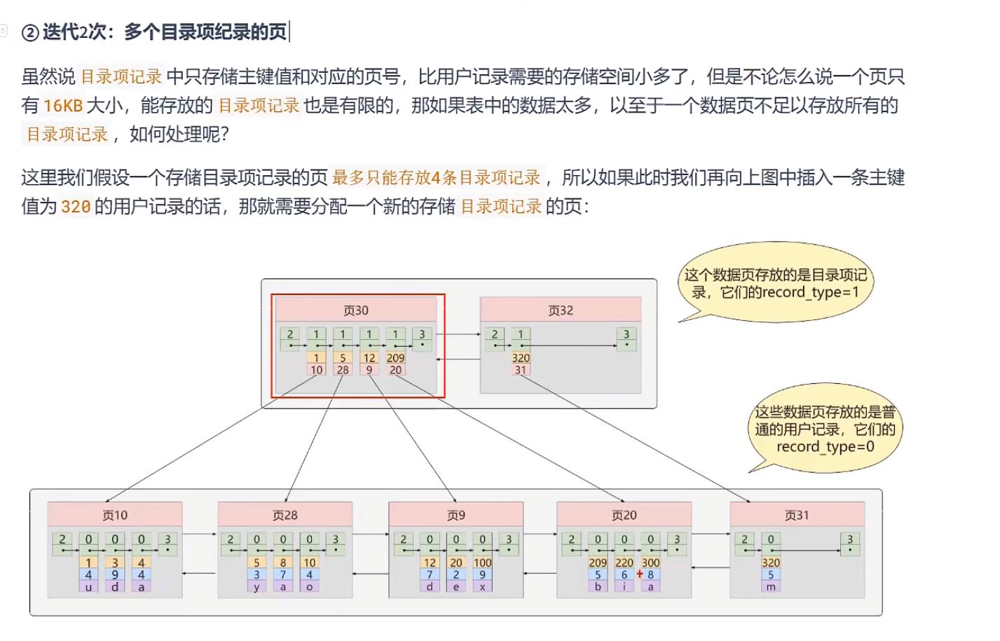
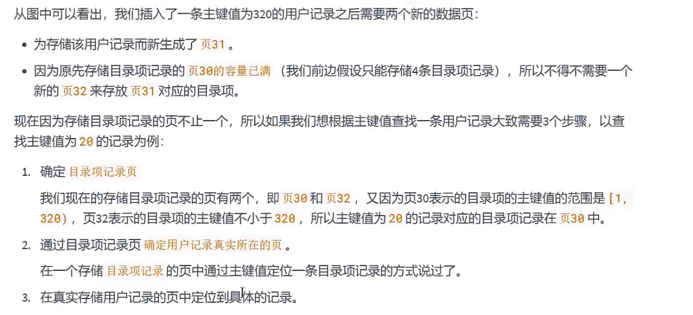
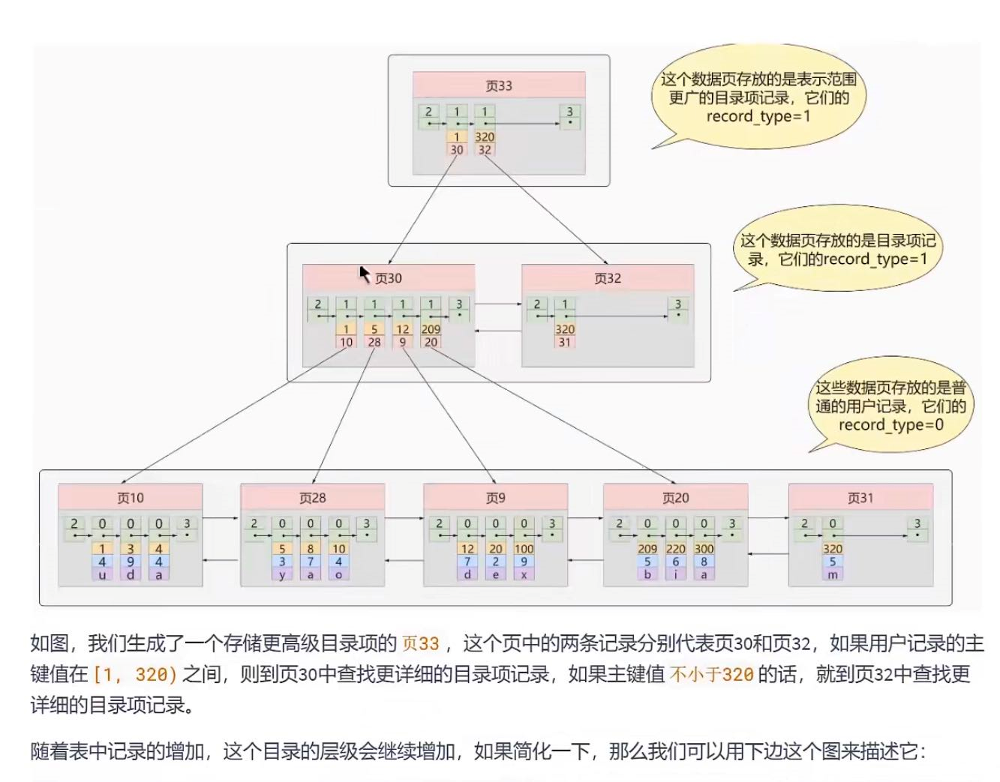
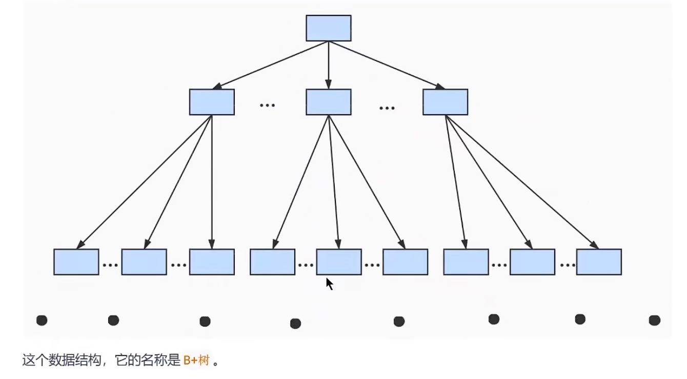
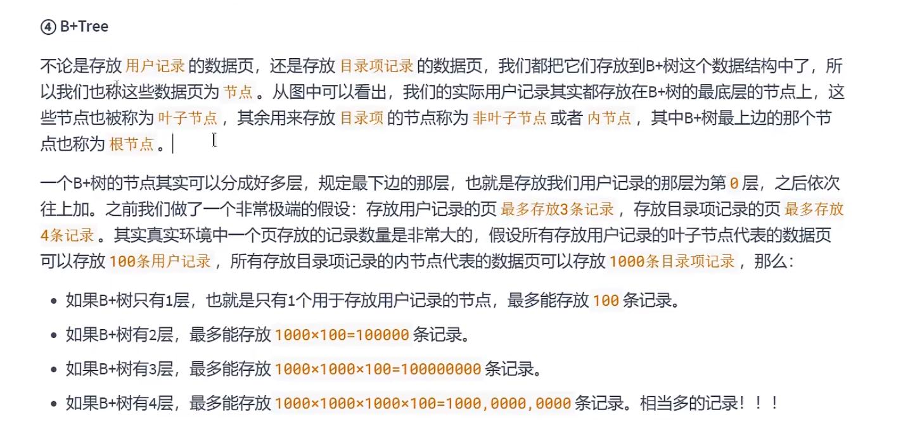

数据页 中的record_type如果是1的话代表这个目录项（目录页） 

如果是0的话代表用户数据（用户数据页）

目录页记录着页的编号和该页最小主键值

用户数据页记录着用户详细数据

目录页和目录页之间使用链表

用户数据页和用户数据页也是用双向链表

迭代一次
---

迭代两次
---

迭代三次
---

B+Tree
---

最上面是目录页的目录页

中间是目录页

下面是用户数据页

