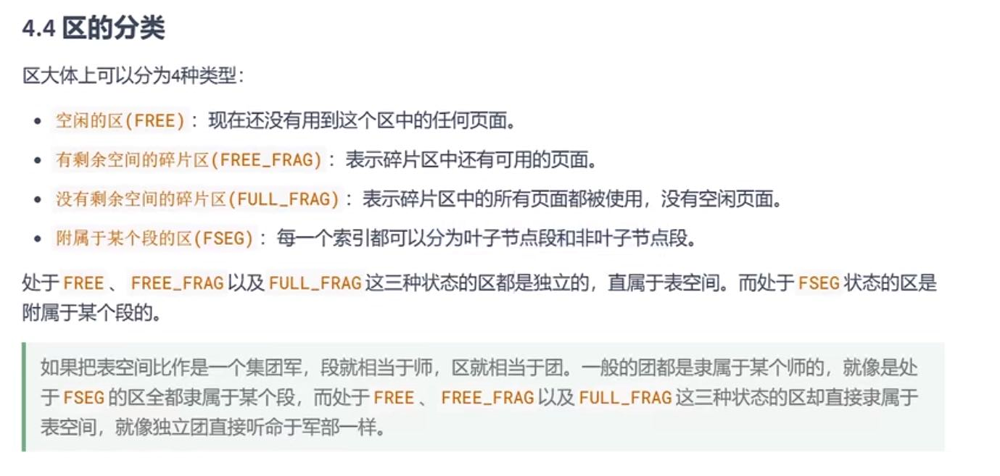
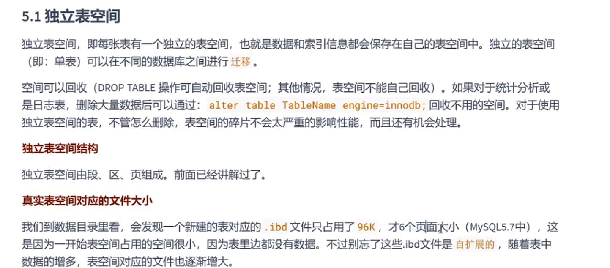
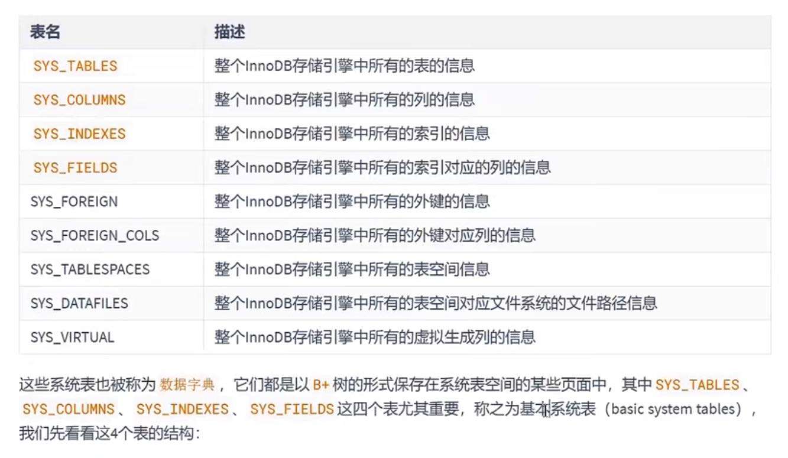
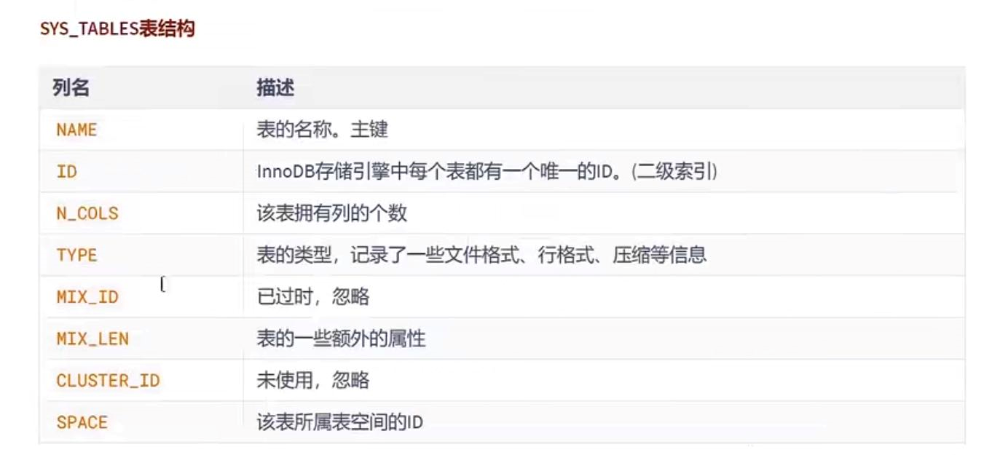
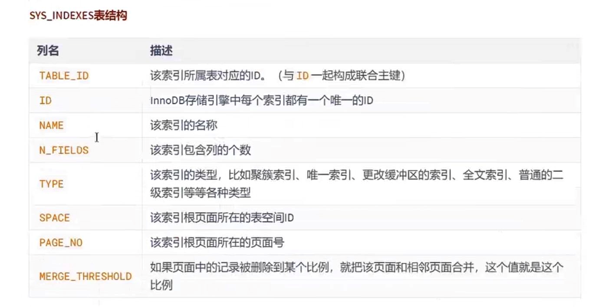
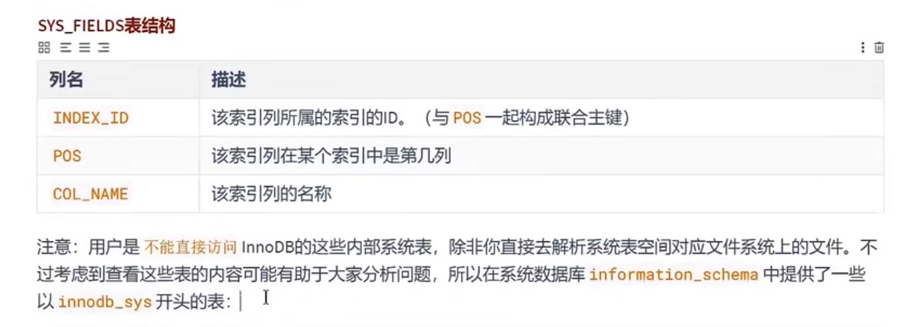
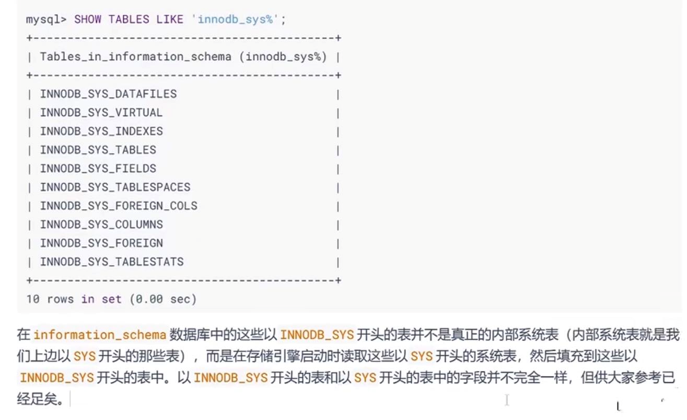

区 extant
---

一个区在物理位置(磁盘)就是64个页

一个区大小是64*16KB=1MB

由于页和页之间是链表结构，真实地址不是连续的，如果物理较远，多次查询页数据

造成`随机IO`会非常慢。所以引入了区的概念，从`随机IO`变成接近于`顺序IO`，当然这样会浪费一定的内存（链表不是数组，地址不是连续的）

段 segment
---
将叶子节点的区和非叶子节点的区分别单独存储， 

一个索引会生成两个段，一个`叶子节点段`，`非叶子节点段`

碎片区 fragment
---
对于数据比较小的表，并非放在区中，而是单独的一个碎片区，直属于表空间

当这个表占用 `32个碎片区`后 再申请完整的区 分配存储空间

区的分类
---

表空间
---

独立表空间
---

每张表都有自己的独立表空间

系统表空间
---

系统表空间存储着整个数据库系统的信息

