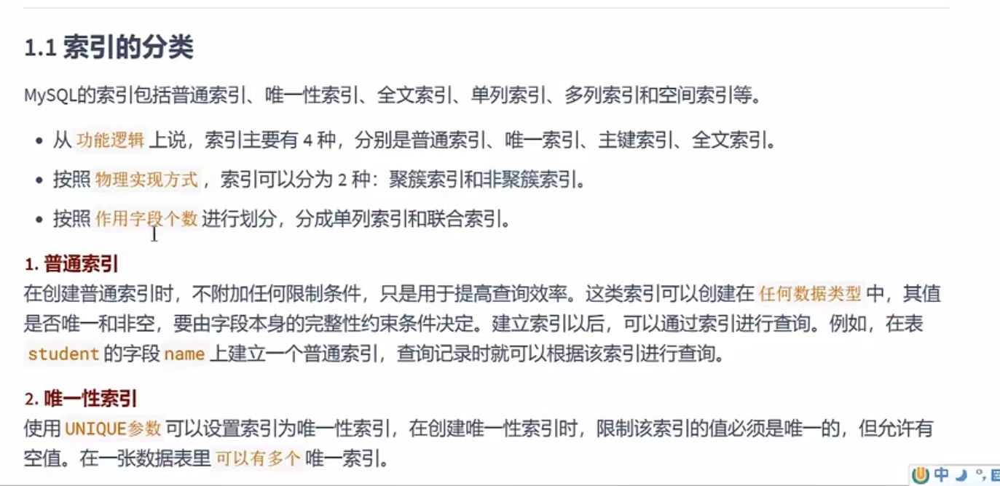
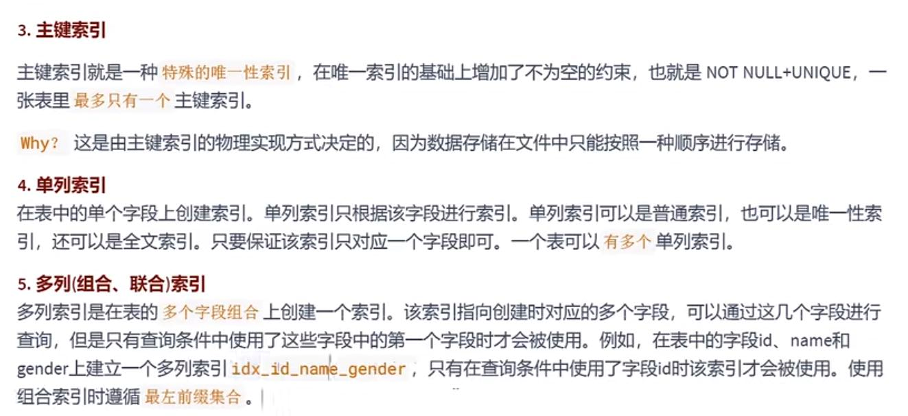
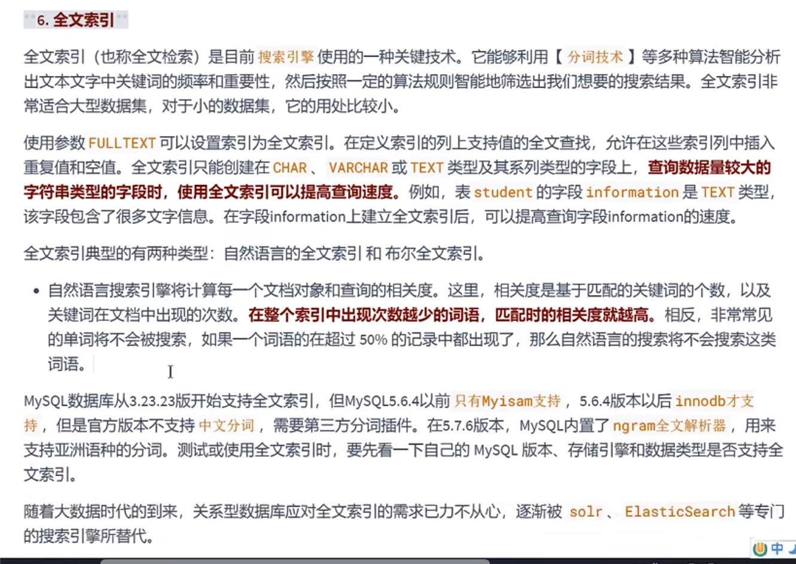
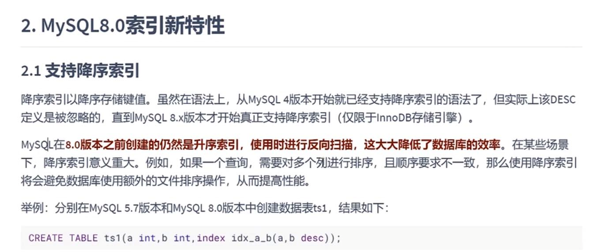
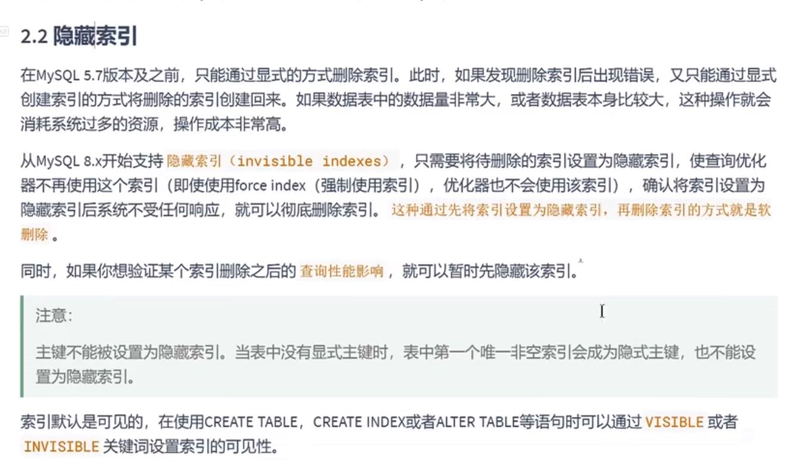
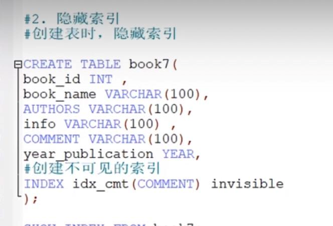

索引分类
---

MySQL 8.0特性
---
支持降序索引和隐藏索引

降序索引
---

8.0前创建的仍然是升序的 如果是反向扫描 效率很低

在执行explain 如果发现 using filesort 这个比较慢的外部排序，说明索引基本没有用到

隐藏索引
---

通过visible invisible关键字设置索引的可见性

主键不能设置为隐藏索引

SQL的执行顺序
---
SELECT FROM WHERE GROUP_BY HAVING ORDER_BY LIMIT