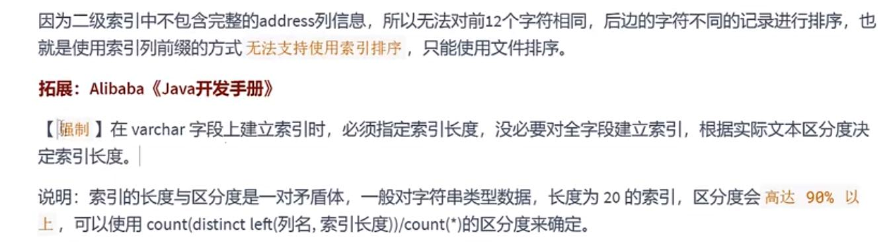

适合创建索引的情况
---

1 字段的数值是唯一性的，必须建成一个索引
---

2 频繁作为where查询条件的字段（一般普通索引即可）
---

3 经常group by 和 order by的列
---

如果同时有group by（字段a） 和 order by（字段b） 的情况呢？

添加两个单列索引：索引只走了student_id,没用create_time

添加联合索引（字段a, 字段b）

添加联合索引（字段b, 字段a）

    如果是 group by a 再 order by b
    表中有两个联合索引 （字段a, 字段b） （字段b, 字段a）
    那只会走 第一个联合索引，因为sql的执行顺序是先group by再 order by

下图中有单列索引a,单列索引b,联合索引（字段b, 字段a）

执行explain发现没走联合索引，

因为先执行了 group by 选择了单列索引a（下图的idx_sid）

4 UPDATE,DELETE的WHERE条件列
---

如果update 中 更正的值（SET的值）是非索引字段，提升效率更明显，因为非索引字段不需要维护索引。

5 DISTINCT字段需要创建索引
---

6 多表JOIN连接操作时，创建索引注意事项
---
1 连接的表不要超过3张，连接查询 嵌套 每加一张表就是加了1次方

2 对`where`查询条件`增加索引`

3 连接`关键字ON`的列，`增加索引`，两张表中的`字段类型`必须一致
(类型不一致，会产生隐式转换，使用函数，使用了函数 索引就失效了)

7 使用列的类型小的创建索引
---

数据列的字段 长度越小 占用的空间就越少，拿是主键来说，在非聚簇索引中主键长度过长，

占用的存储空间越大，页大小不变的情况下，页中存放的数据行就越少。

8 使用字符串前缀创建索引
---

假如 字符串 100位长度 截取20位 查询的结果重复，但是对应的主键不一样 

回表到聚簇索引中 根据主键查询出数据再进行对比

通过公式：

    count(distinct left(列名，索引长度))/count(*)

结果越高，说明重复度越小

实际工作中并不要强求接近1,无特殊要求时,达到0.1就可以了.

但使用了前缀索引，查询语句是 SELECT ... ORDER BY 字段A

这个字段A使用了前缀索引，因为是索引文件是不完整的信息

大概率排序正确率就有问题

9 使用散列度高的字段作为索引
---

类似于性别这种，只分男女。或者业务枚举（只有几个状态）映射到数据库字段。

这种散列度低的不适合做索引 

公式：
    
    select count(distinct a)/count(*) from t1

如果是联合索引 `区分度高的放前面` (优化器会找区分度高的)

10 使用最频繁的列放在联合索引的左侧
---
符合`最左前缀原则`

11 在多个字段都要创建索引的情况下，联合索引优于单列索引
---

表中建立多个索引，优化器在判断选择哪个索引时，花的时间也越多。
explain 中 的possible（可能的） key  能显示可能选择的索引

