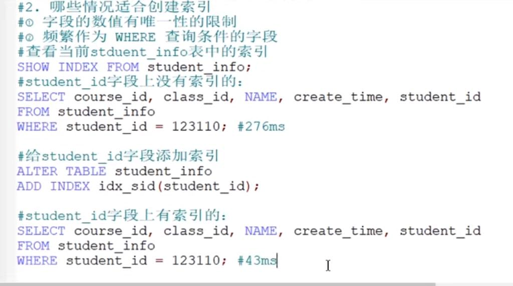
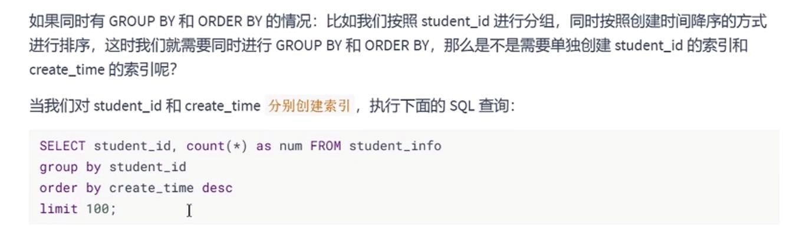
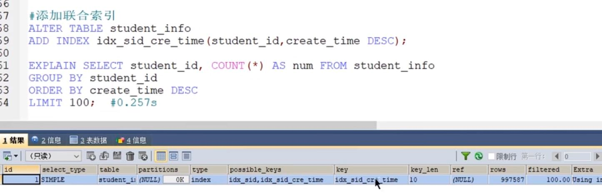

适合创建索引的情况
---

字段的数值是唯一性的，必须建成一个索引
---

频繁作为where查询条件的字段（一般普通索引即可）
---

经常group by 和 order by的列
---

如果同时有group by（字段a） 和 order by（字段b） 的情况呢？

添加两个单列索引：索引只走了student_id,没用create_time

添加联合索引（字段a, 字段b）

添加联合索引（字段b, 字段a）

    如果是 group by a 再 order by b
    表中有两个联合索引 （字段a, 字段b） （字段b, 字段a）
    那只会走 第一个联合索引，因为sql的执行顺序是先group by再 order by

下图中有单列索引a,单列索引b,联合索引（字段b, 字段a）

执行explain发现没走联合索引，

因为先执行了 group by 选择了单列索引a（下图的idx_sid）

UPDATE,DELETE的WHERE条件列
---

如果update 中 更正的值（SET的值）是非索引字段，提升效率更明显，因为非索引字段不需要维护索引。

