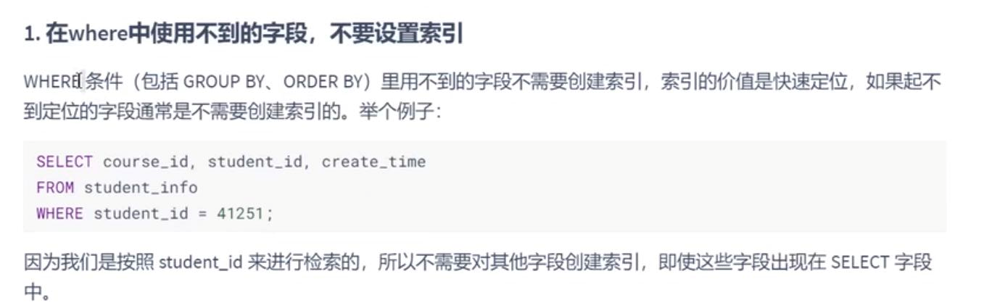
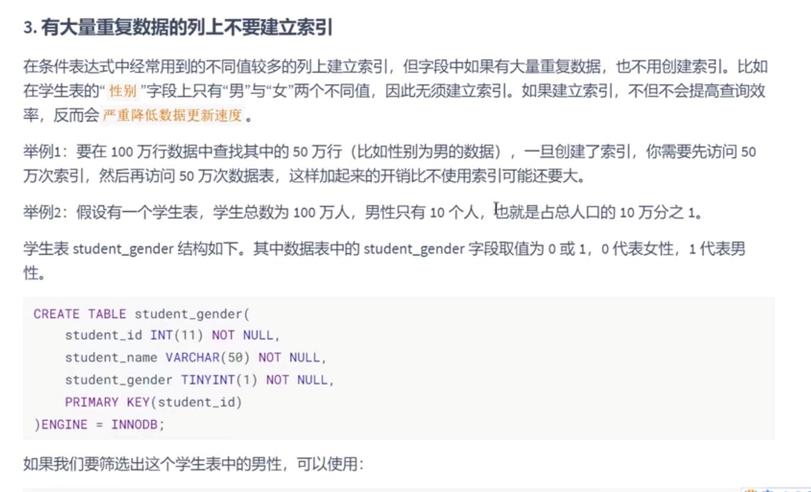
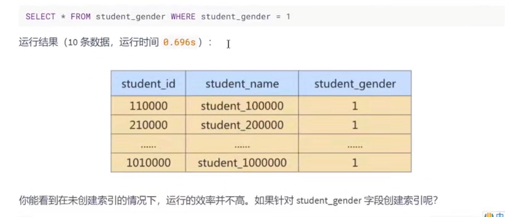
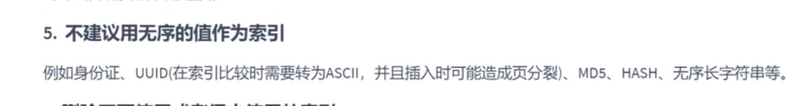
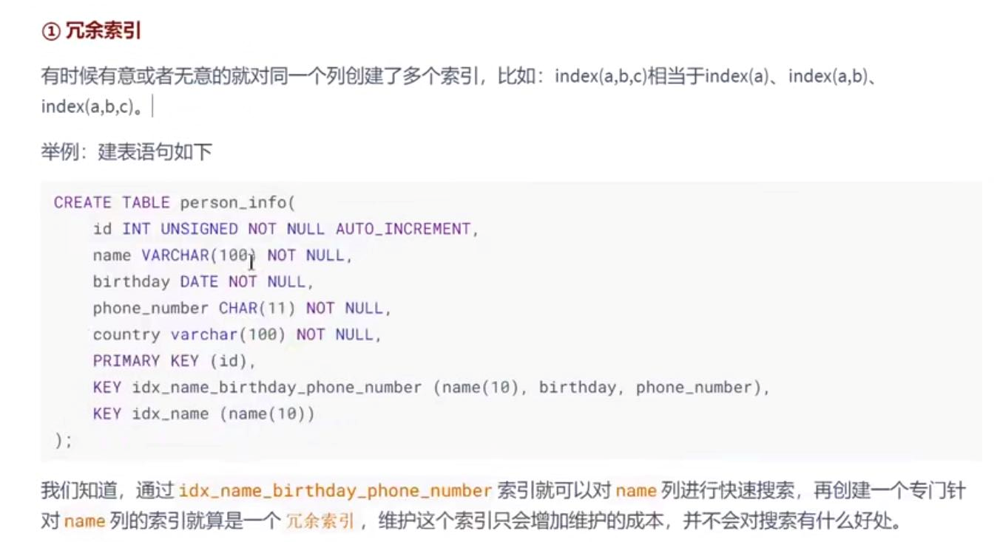
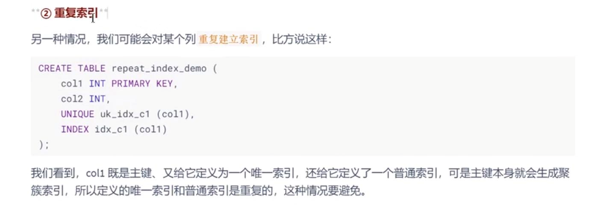

1 where条件中使用不到的不要建索引
---

2 数据量小的最好不要用索引
---

3 大量重复数据的列上不要创建索引
---

4 避免对经常更新的表创建过多的索引
---

5 不建议用无序的值创建索引
---

无序的值 造成页分裂 例如身份证号, MD5, HASH

6 删除不再使用或者很少使用的索引
---

7 不要定义冗余或重复的索引
---

在表中不要定义  

联合索引（a,b）再加一个 单列索引（a）

