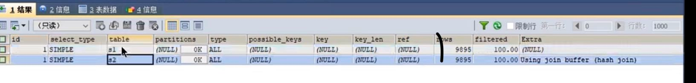
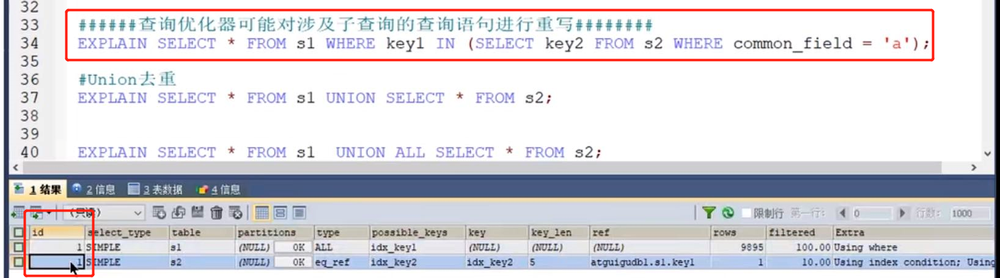
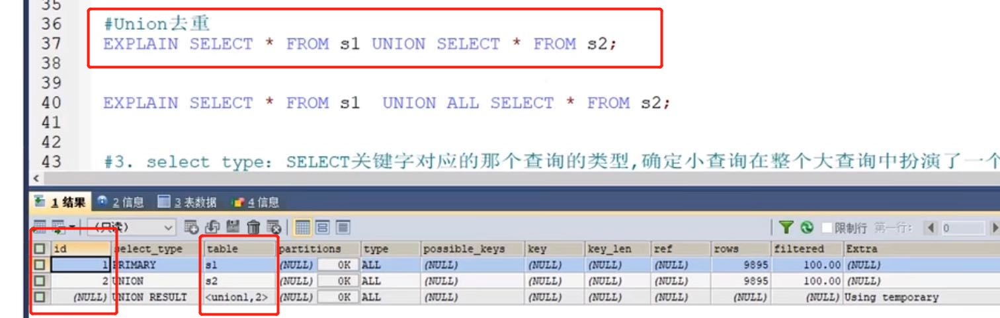

table 表名
---

查询的每一行记录都对于一个单表

    explain select * from s1 inner join s2;

s1就是驱动表 s2就是被驱动表

ID 
---
在一个大的查询语句中每个select关键字都对应一个唯一的ID

一个查询语句中 多个select（子查询之类）每个select都有一个ID

inner join 查询两个表  table有两个 但是ID只有一个

不过查询优化器可能对查询语句重写，转换成多表查询的操作

PS：IN查询的范围过大，会走全表扫描，不走索引

两张表进行union 会有临时表 <union1,2>

    union: 取并集 不包括重复行 去重，排序
    
    union all: 取并集 包括重复行 不去重，不排序

当执行结果中的 extra 显示 using temporary 就是临时表的意思

