select_type
---

对于关联查询或者子查询，多个select的每个select对应的角色

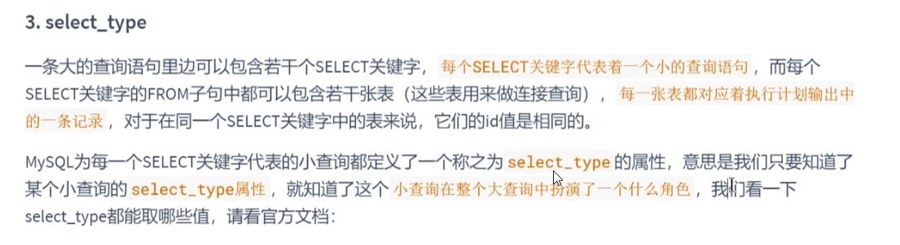

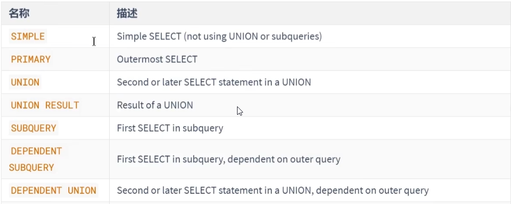

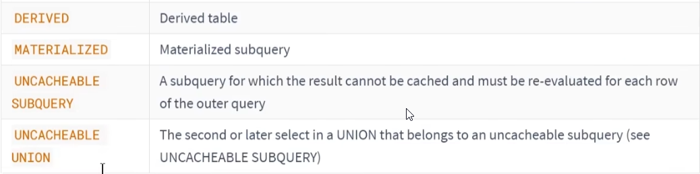

simple
---

primary, union, union result
---

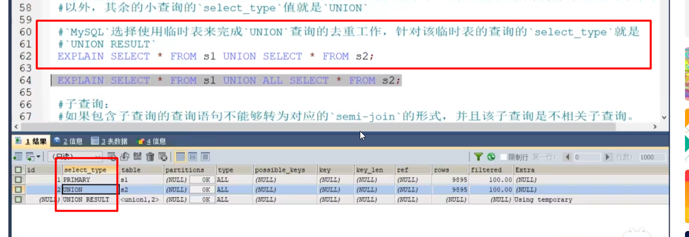

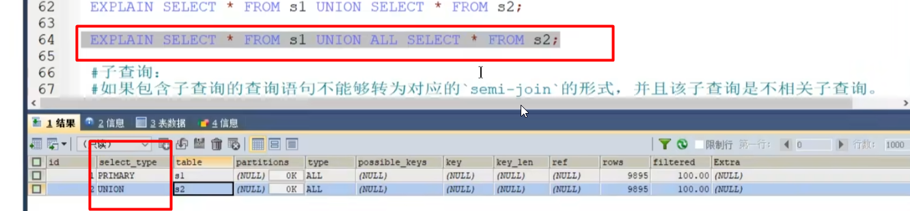

sub_query 不相关子查询
---

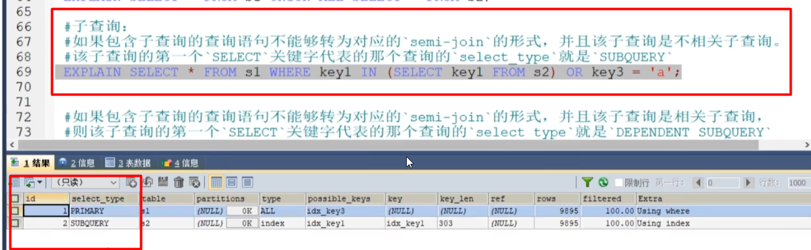

dependent_sub_query 相关子查询
---

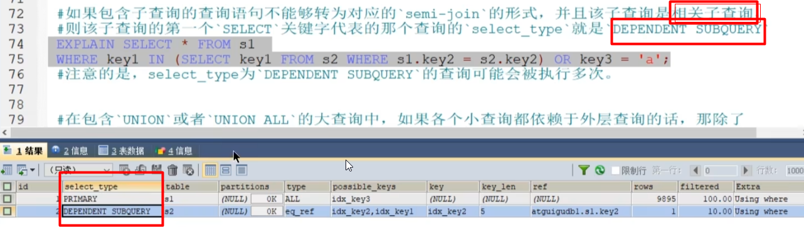

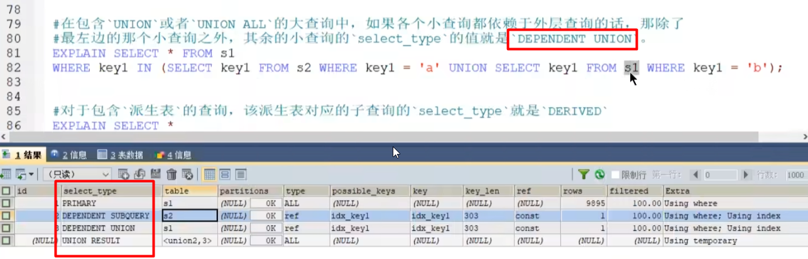

derived 派生表
---

下图中的derived2 就是由id 1构成的

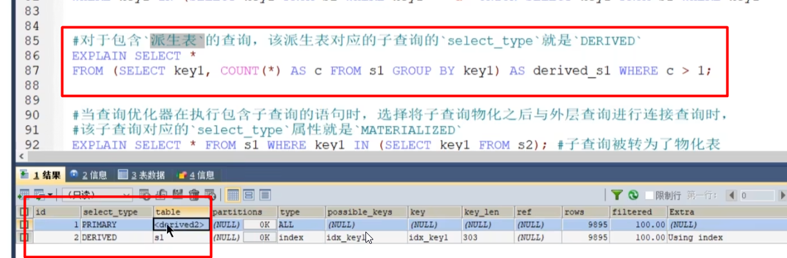

materialized  物化表
---

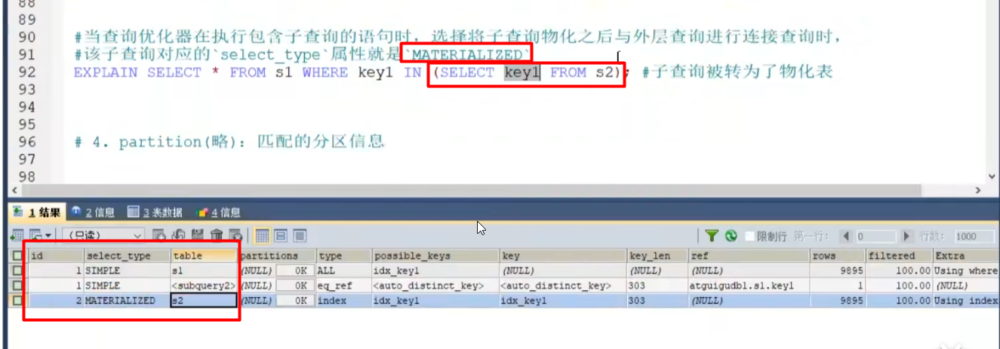

partition
---

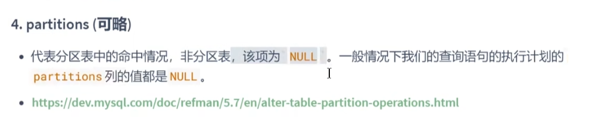