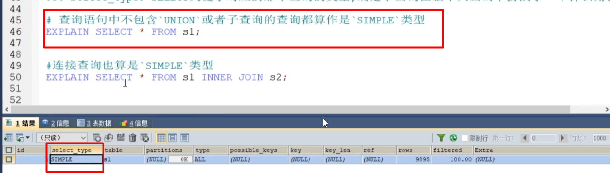

select_type
---

对于关联查询或者子查询，多个select的每个select对应的角色

simple
---

primary, union, union result
---

sub_query 不相关子查询
---

dependent_sub_query 相关子查询
---

derived 派生表
---

下图中的derived2 就是由id 1构成的

materialized  物化表
---

partition
---

