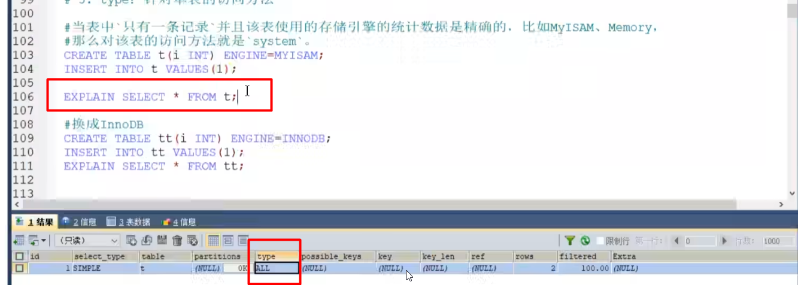

type
---

system，all
---

system是最快的，myisam引擎是讲表记录数单独存储的

使用select count(*) 直接走system

如果是查询select * from 字段没有索引 那就是all 最慢的

innoDB和myISAM一样 没索引就是all

const(constant) 常数 常量
---

使用索引和常量进行等值配置的就是const

eq_ref(unique index 等值匹配)
---

ref(普通index 等值匹配)
---

ref_or_null(普通index，可为null)
---

index_merge(两个单列索引合并)
---

unique_subQuery
---

range(范围查询)
---

index(可以使用索引覆盖，例如联合索引，但是要扫描全部的索引文件)
---

all
---
