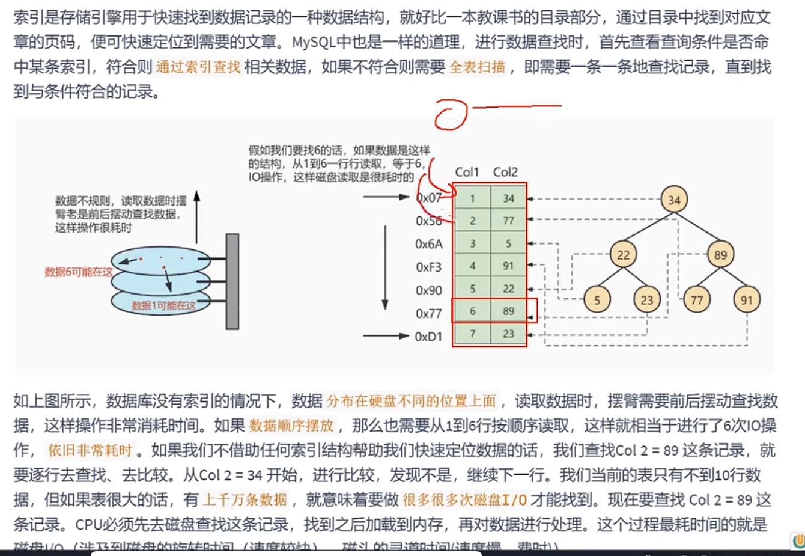
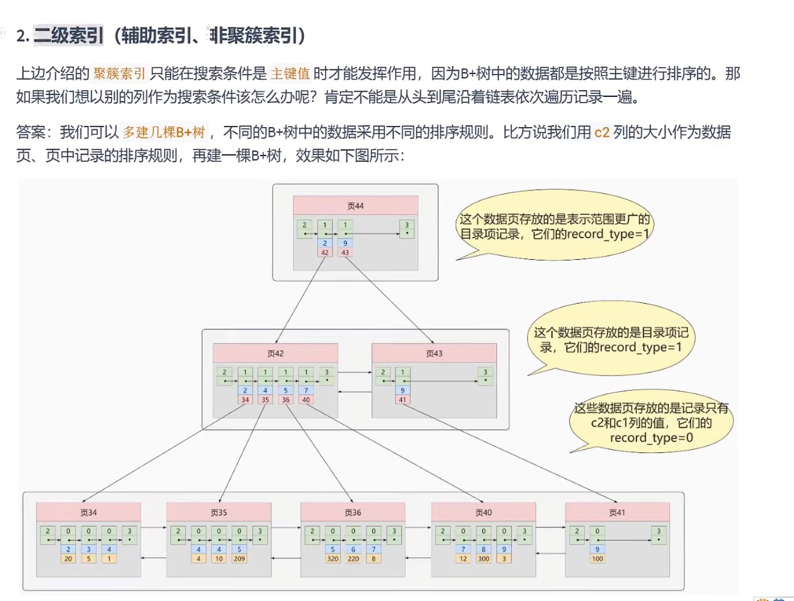
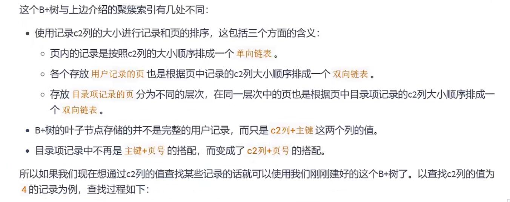
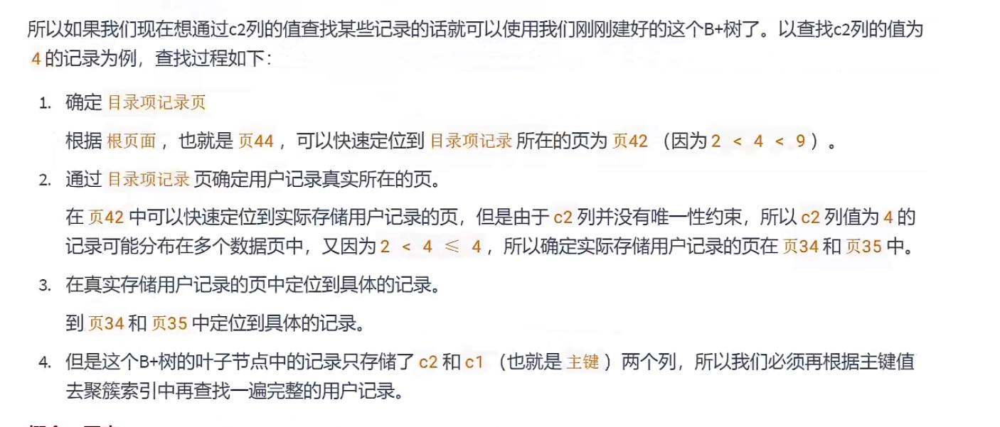
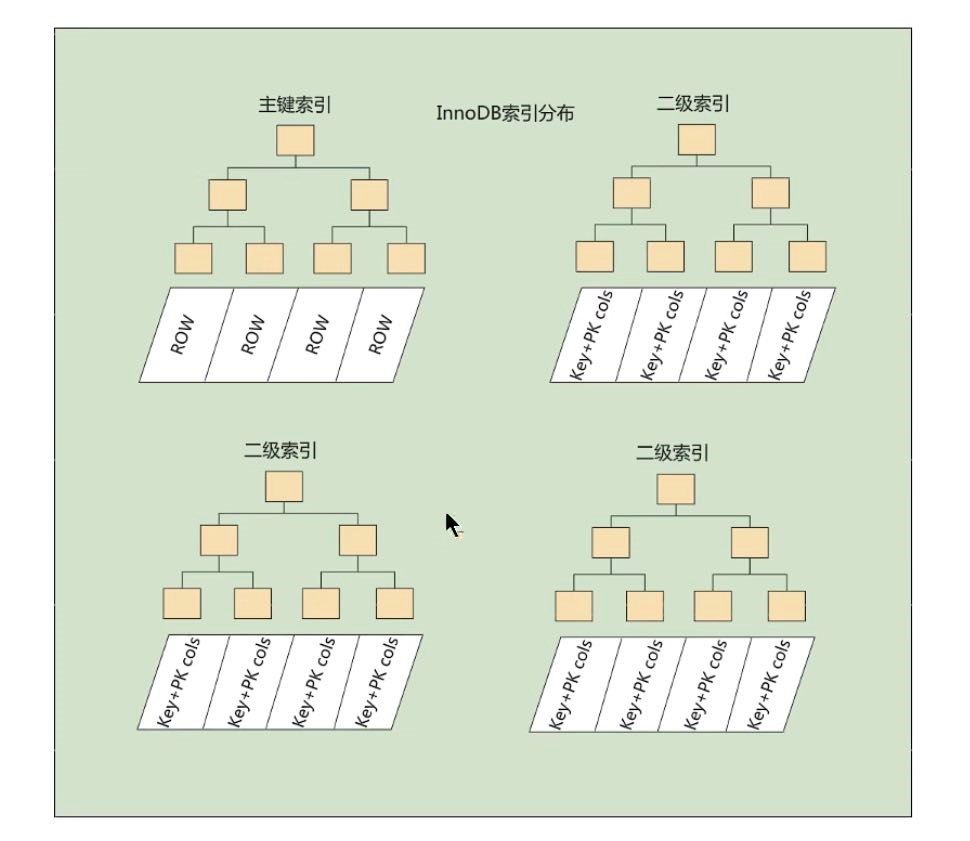

聚簇索引（存放了完整的用户数据）
---

InnoDB数据库表中**主键**的索引就是聚簇索引

如果没有显示定义**主键**，innoDB会寻找一**非空唯一索引**来代替 innoDB会隐式的设置一个**主键**

一个表只能有一个聚簇索引

**InnoDB中支持聚簇索引，MyISAM中是不支持聚簇索引的**

尽量选择有序的顺序id，这样能充分利用聚簇索引的特性，查询和范围查询更快，而且能避免页分裂。

（雪花算法也是整体递增有序的）

用户页和目录页都是双向链表

页内的记录是单向列表

B+树的叶子节点存储的是完整的用户数据记录。

目录页多于一个在上级再增加一个目录管理页

目录页的record_type都是1，而用户记录页的record_type都是0

优点：

    聚簇索引将索引和数据存放在同一个b+树，因此聚簇索引获取数据比非聚簇索引快。
    
    聚簇索引对主键的排序查找和范围查找速度非常快。

    聚簇索引按顺序排列，如果是范围查询，数据都是紧密连接的，能减少IO操作

缺点：

    插入速度严重依赖 插入排序，按照主键的顺序插入是最快的，如果是非顺序的插入，会导致

    页分裂，对InnoDB，一般来说 会设置 自增的ID 作为主键

    二级索引 需要 两次索引查找

二级索引（非聚簇索引，辅助索引）（只存放当前列和主键两个数据）
---
如果不以主键作为搜索列，可以再创建B+树。

目录页中 存放的是用户数据页 （C2列）的最小数据，及用户数据页的页码。

非聚簇索引的叶子节点 也就是 用户数据页，并不像聚簇索引存放了完整的用户数据。

而是值存放了C2列和主键 两个列的值。

因为聚簇索引中的叶子节点才存放了完整的用户数据，而非聚簇索引的叶子节点只有相关列和主键的数据，

所有必须根据主键值去聚簇索引中再查找一遍完整的用户记录。

回表
---
如果把完整的用户记录放在非聚簇索引的话是可以不用回表的，但是每加一个索引，就要建一颗b+树

这样数据严重冗余，浪费存储空间。

如果说直接存数据的存储地址的话，如果数据迁移就会非常麻烦了。

