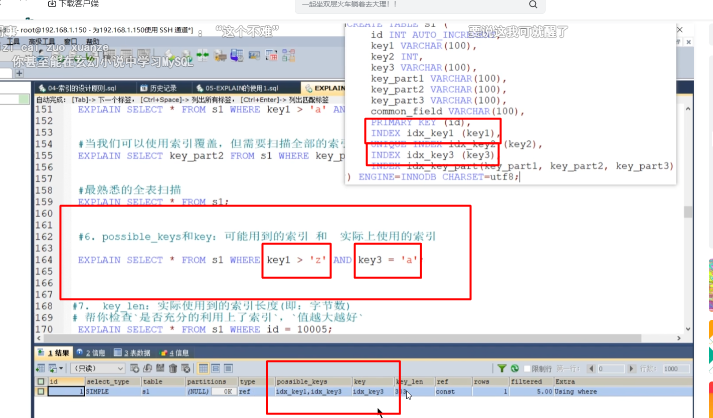
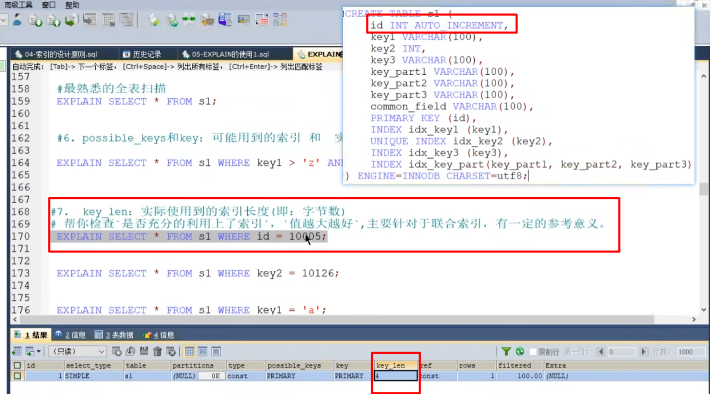
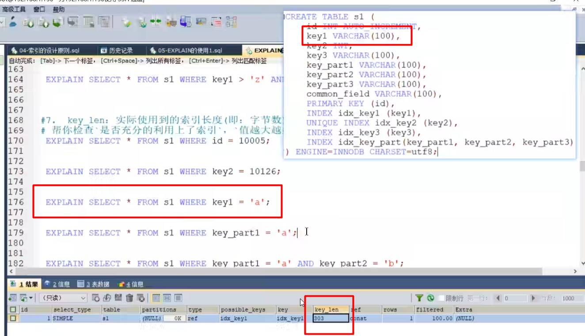
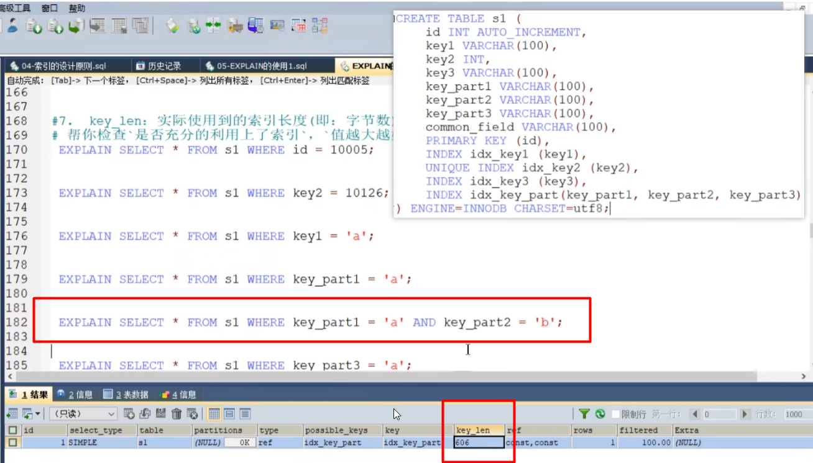
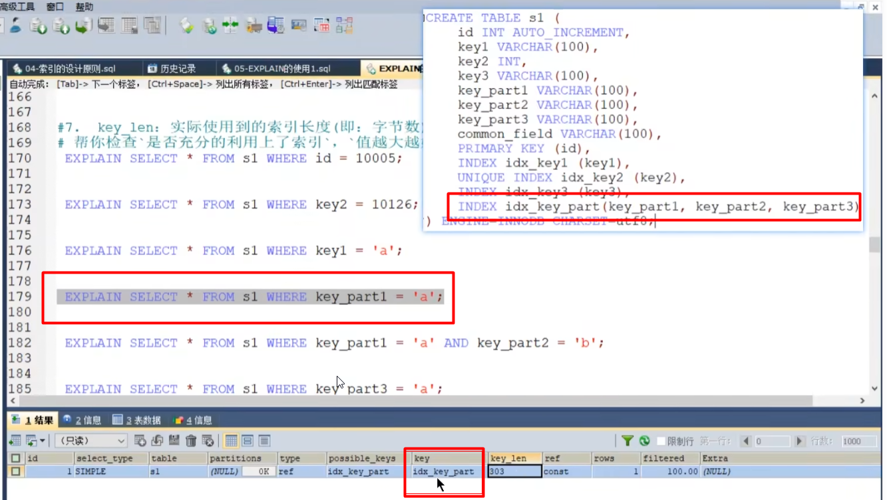

possible_keys和key
---

可能用到的索引

下图中的两个条件 一个是等值 一个是范围 肯定用等值的

key_len
---

实际使用的索引长度（字节），越大越好

id是int类型 4字节 

key1是varchar UTF8占3字节， 100*3 

（行格式内容：加一位null值（判断该字段内数据是不是null） 加两位变长字段） 就是303 

下图是联合索引的使用，越长越好 命中更精确

