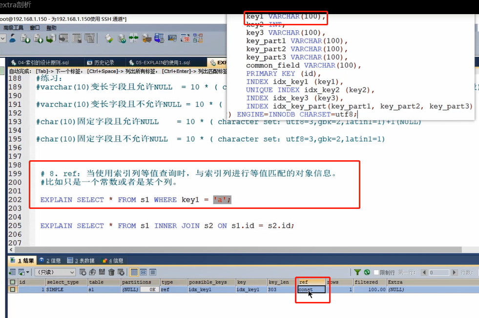
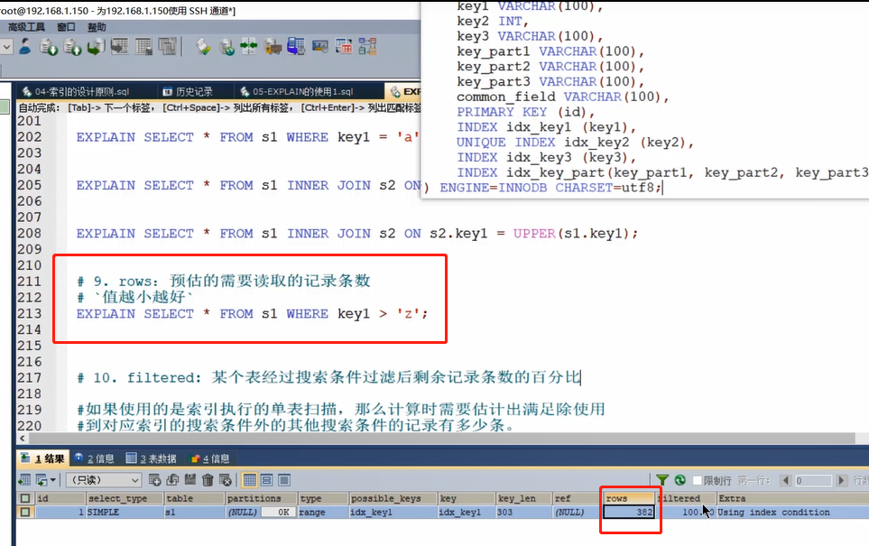
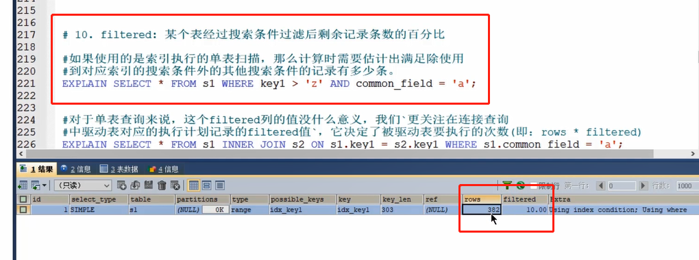
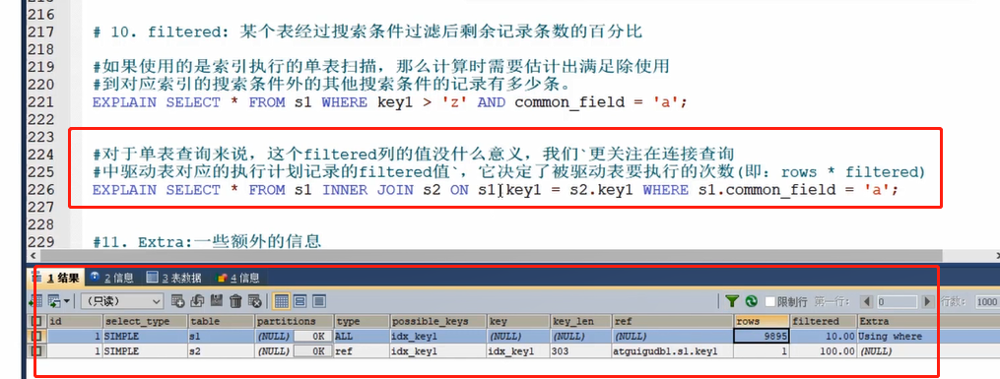

ref
---

当使用索引查询时，与索引列进行等值匹配的对象信息

rows
---

预估的需要读取的记录条数（值越小越好）

filtered
---

经过搜索条件过滤后剩余记录条数的百分比

和rows是关联关系

下图就是说预估382条记录，实际过滤后剩10% 大概38，39条数据

下图是关联查询

驱动表的filtered * rows 大概989条数据是 ON 连接的数据

