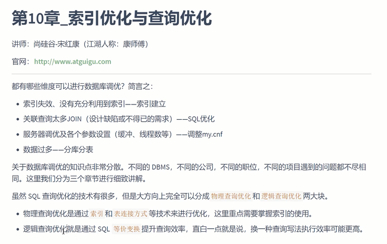
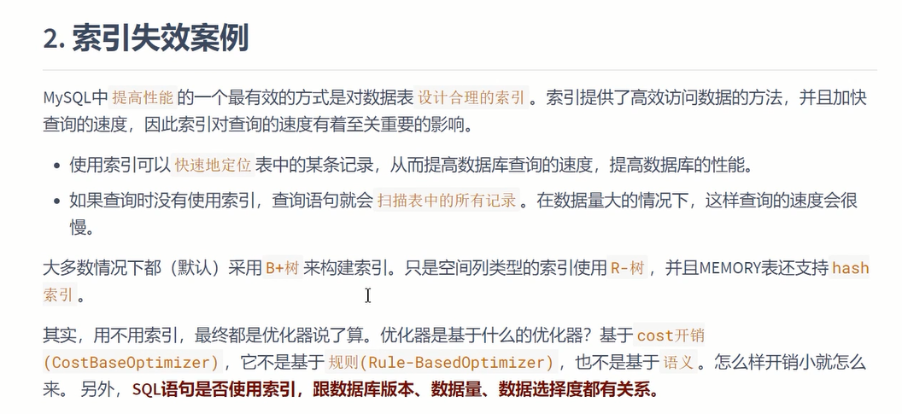
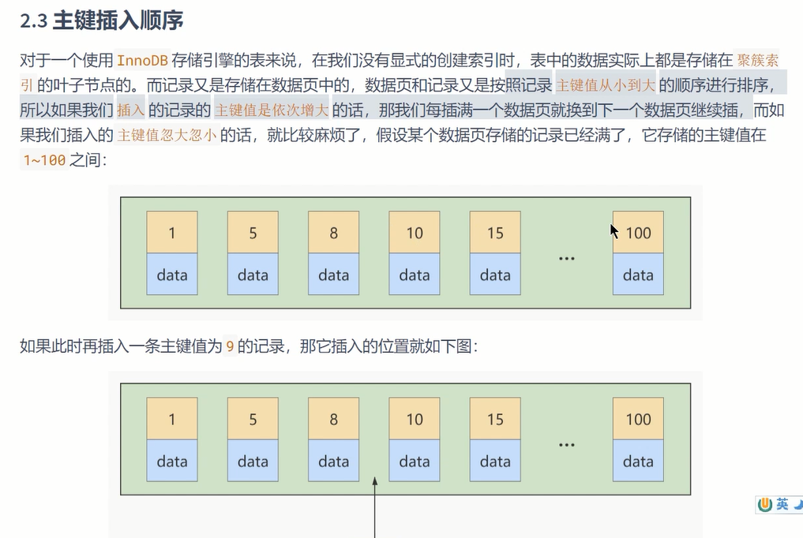
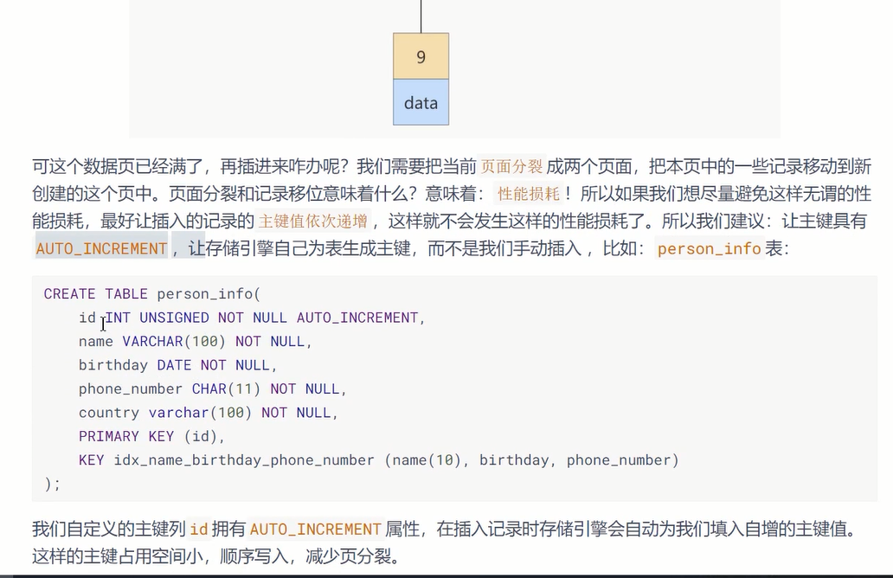
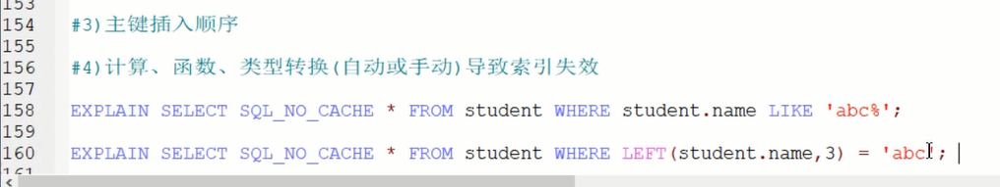
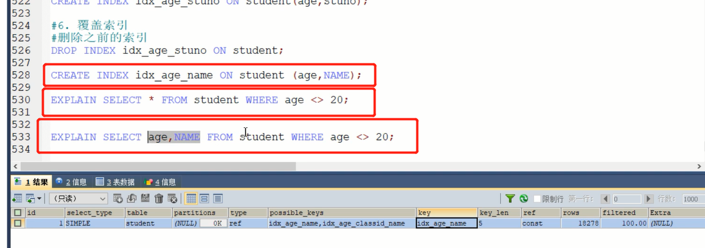

1 全值匹配

2 最佳左前缀

3 主键插入顺序

4 计算 函数 类型转换 导致索引失效

5 范围条件右侧的索引失效

6 不等于 !=  <> 索引失效

    但是如果是覆盖索引，查询结果都在二级索引中，不用回表，那不等于也可以生效

7 is null可以使用索引， is not null无法使用索引(跟!= <>类似 ，is null类似于等于， is not null类似于不等于)

    值为NULL的二级索引记录都被放在了B+树的最左边    

    要扫描的二级索引记录条数越多，那么需要执行的回表操作的次数也就越多，达到了某个比例时，使用二级索引执行查询的成本也就超过了全表扫描的成本。比方说要扫描的全部的二级索引记录，那就要对每条记录执行一遍回表操作，自然不如直接扫描聚簇索引来的快。

8 like 以通配符开头的索引失效 

    如果是覆盖索引 不用回表 也可以生效

9 OR前后存在非索引的列

8 数据库和表统一使用UTF8MB4

