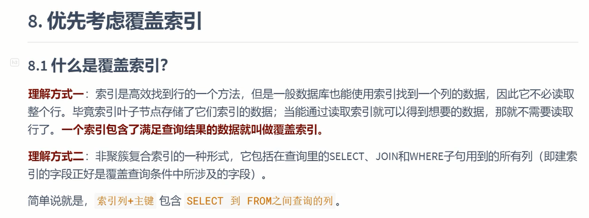
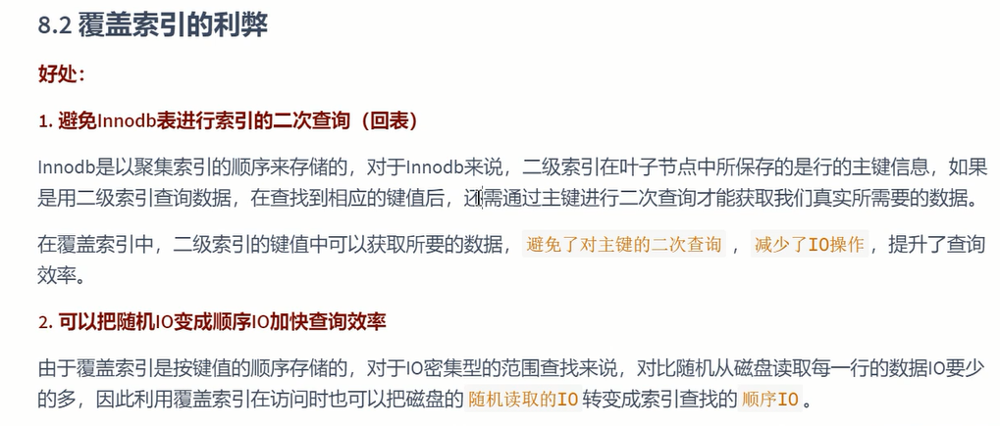
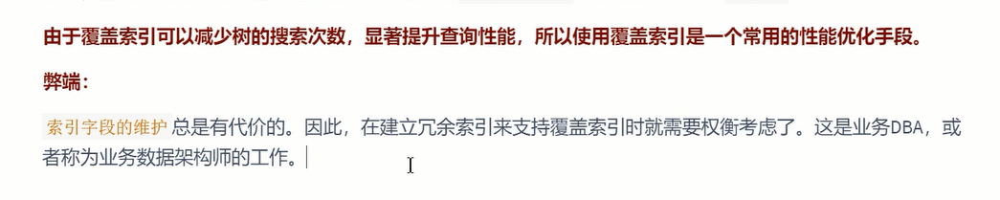
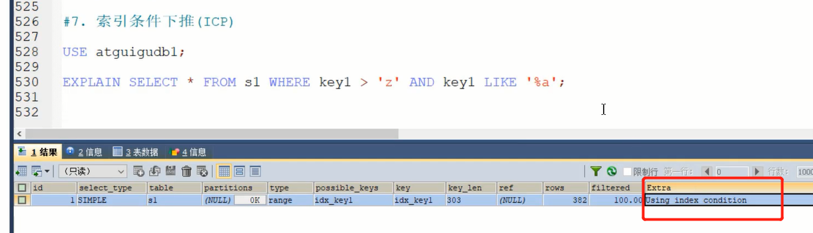
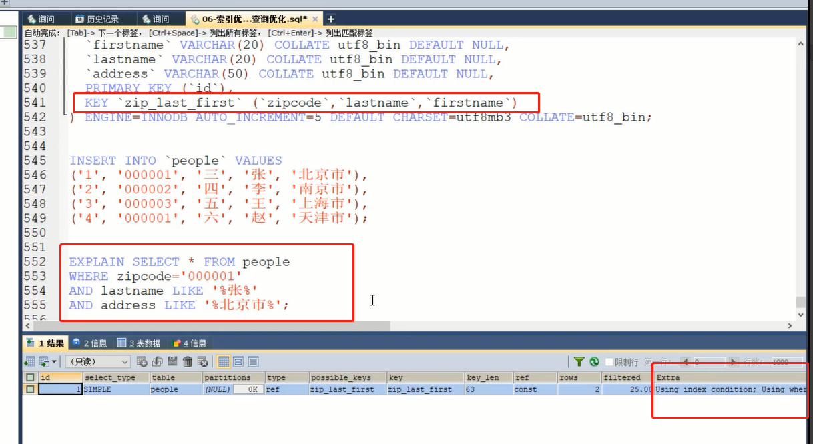
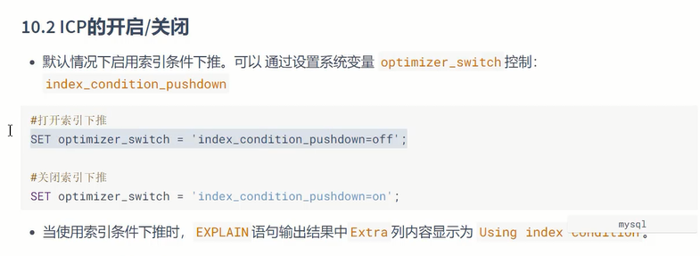
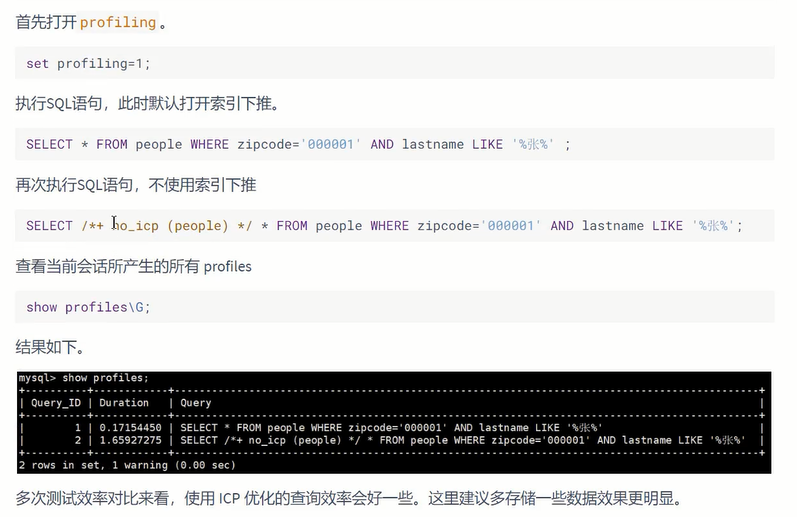

一个索引满足查询结果 

select a,b from A where a=1 and b=2;

覆盖索引的利弊
---

避免innoDB回表

把随机IO变成顺序IO（回表可能造成随机IO）

索引条件下推 （index condition pushdown）
---

默认启动

二级索引查询后并不一定要回表，

范围较小时，可以先根据其他字段判断(即使该字段是模糊查询)（当然这个字段也得在二级索引中）

筛选后再回表，减少IO。

只用了 zip_last_first 中的一部分索引 zipcode

